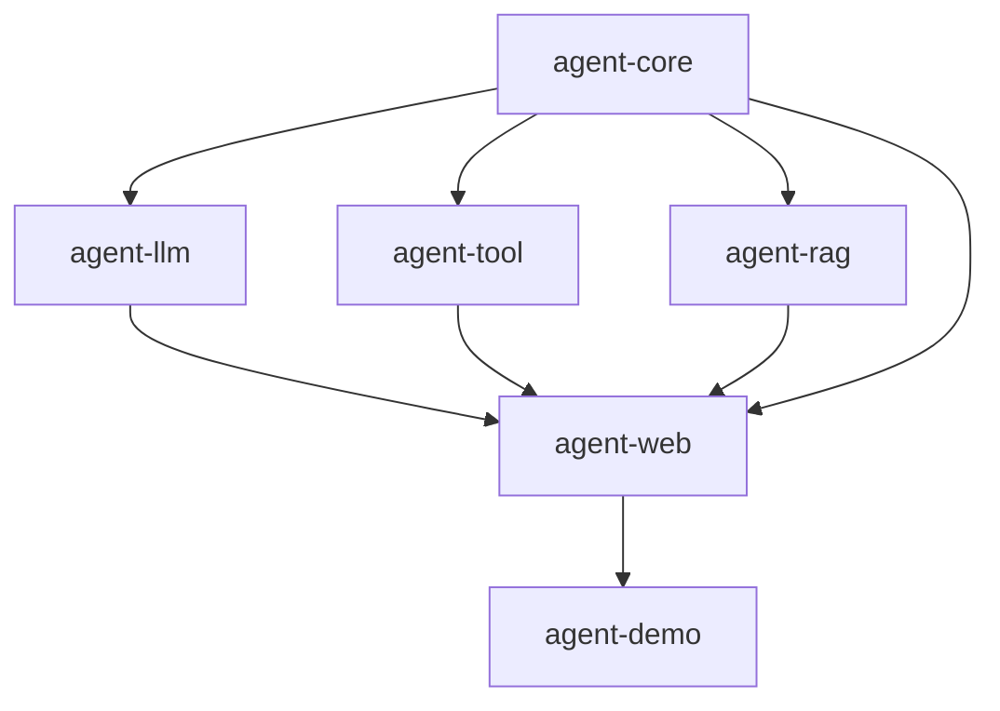
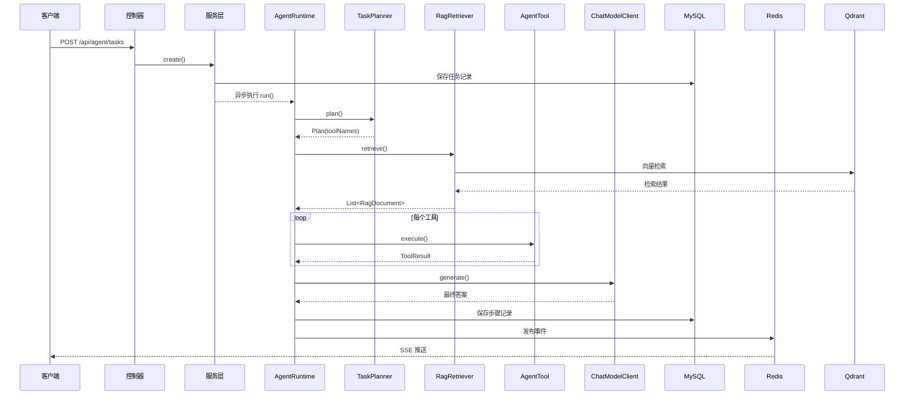
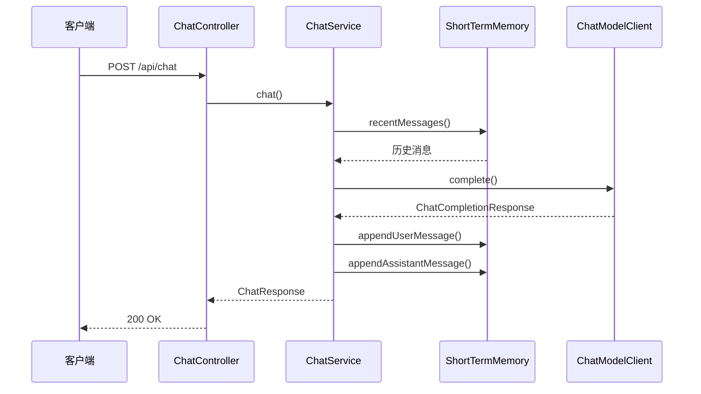
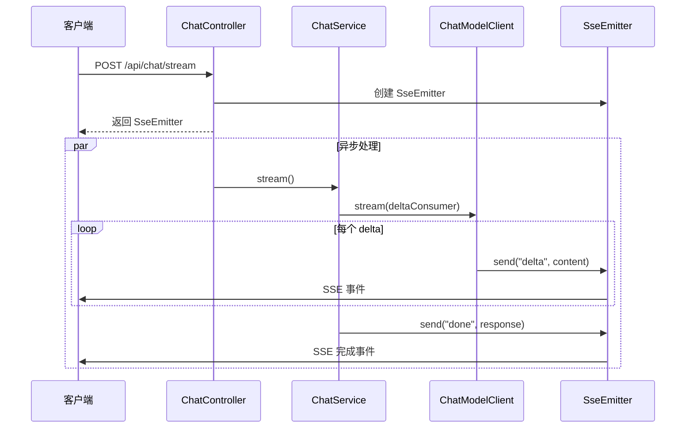
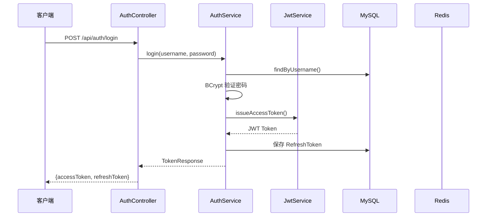
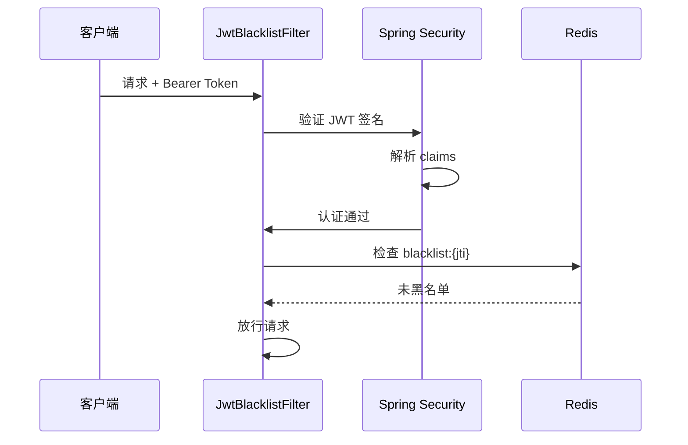
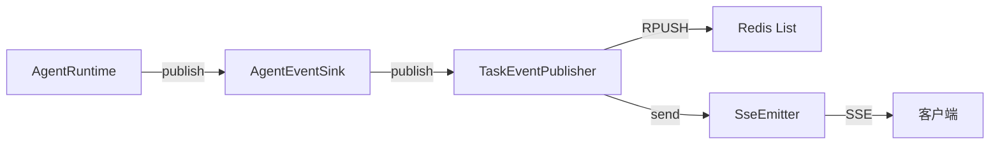

# 系统架构说明

## 1. 架构概述

AgentFlow-Java 采用**六边形架构（Hexagonal Architecture）**，也称为端口与适配器架构。核心思想是将业务逻辑与外部依赖解耦，通过接口（端口）定义契约，通过实现（适配器）连接外部系统。

### 1.1 架构原则

| 原则 | 实现方式 |
|------|---------|
| 依赖倒置 | 核心接口定义在 agent-core，实现在各适配器模块 |
| 单一职责 | 每个模块只负责一个领域（LLM、工具、RAG） |
| 开闭原则 | 通过 @ConditionalOnMissingBean 支持实现替换 |
| 接口隔离 | 12 个核心接口，每个接口职责明确 |

### 1.2 分层架构图

```
┌─────────────────────────────────────────────────────────┐
│                    agent-demo（应用层）                    │
│         @SpringBootApplication + 业务工具 + 知识库         │
├─────────────────────────────────────────────────────────┤
│                    agent-web（组装层）                     │
│    控制器 + 认证 + JPA + Redis + DefaultAgentRuntime      │
├───────────┬───────────────┬──────────────┬──────────────┤
│ agent-llm │  agent-tool   │  agent-rag   │  （适配器层）  │
│ LLM客户端  │  工具注册表    │  RAG检索器    │              │
├───────────┴───────────────┴──────────────┴──────────────┤
│                  agent-core（核心抽象层）                  │
│           纯接口 + 记录 + 枚举，零外部依赖                  │
└─────────────────────────────────────────────────────────┘
```

## 2. 模块依赖关系

### 2.1 Maven 依赖图



### 2.2 依赖详情

| 模块 | 依赖 | 依赖类型 |
|------|------|---------|
| agent-core | 无 | - |
| agent-llm | agent-core | compile |
| agent-tool | agent-core | compile |
| agent-rag | agent-core | compile |
| agent-web | agent-core, agent-llm, agent-tool, agent-rag | compile |
| agent-demo | agent-web | compile |

**代码依据**：各模块 `pom.xml` 文件

## 3. 核心接口设计

### 3.1 接口清单

| 接口 | 包路径 | 职责 | 实现类 |
|------|--------|------|--------|
| `AgentRuntime` | `com.agentflow.core` | Agent 运行时入口 | `DefaultAgentRuntime` |
| `AgentEventSink` | `com.agentflow.core` | 事件发布 | `TaskEventPublisher` |
| `ChatModelClient` | `com.agentflow.core.chat` | LLM 对话客户端 | `OpenAiCompatibleModelClient` |
| `AgentModelClient` | `com.agentflow.core.model` | Agent 专用模型客户端 | `OpenAiCompatibleModelClient` |
| `EmbeddingClient` | `com.agentflow.core.model` | 向量化客户端 | `OpenAiCompatibleModelClient` |
| `TaskPlanner` | `com.agentflow.core.planner` | 任务规划器 | `SimpleTaskPlanner` |
| `RagRetriever` | `com.agentflow.core.rag` | 知识检索器 | `KnowledgeRagRetriever` |
| `ShortTermMemory` | `com.agentflow.core.memory` | 短期记忆 | `RedisShortTermMemory` |
| `StepRecorder` | `com.agentflow.core.step` | 步骤记录器 | `JpaStepRecorder` |
| `AgentTool` | `com.agentflow.core.tool` | 工具接口 | `InterfaceDraftTool` 等 |
| `ToolRegistry` | `com.agentflow.core.tool` | 工具注册表 | `InMemoryToolRegistry` |
| `ToolProvider` | `com.agentflow.core.tool` | 工具提供者 | `McpToolProvider` |

**代码依据**：`agent-core/src/main/java/com/agentflow/core/` 目录下所有接口

### 3.2 数据传输对象（Records）

| Record | 包路径 | 用途 |
|--------|--------|------|
| `AgentRequest` | `com.agentflow.core` | Agent 任务请求 |
| `AgentResult` | `com.agentflow.core` | Agent 执行结果 |
| `AgentEvent` | `com.agentflow.core` | Agent 事件 |
| `AgentStepRecord` | `com.agentflow.core` | 步骤执行记录 |
| `ModelPrompt` | `com.agentflow.core.model` | 模型提示词 |
| `Plan` | `com.agentflow.core.planner` | 执行计划 |
| `RagDocument` | `com.agentflow.core.rag` | RAG 文档 |
| `ToolContext` | `com.agentflow.core.tool` | 工具执行上下文 |
| `ToolResult` | `com.agentflow.core.tool` | 工具执行结果 |
| `ChatMessage` | `com.agentflow.core.chat` | 聊天消息 |
| `ChatCompletionRequest` | `com.agentflow.core.chat` | 聊天请求 |
| `ChatCompletionResponse` | `com.agentflow.core.chat` | 聊天响应 |
| `TokenUsage` | `com.agentflow.core.chat` | Token 使用量 |

**代码依据**：`agent-core/src/main/java/com/agentflow/core/` 目录下所有 Record 类

### 3.3 枚举定义

| 枚举 | 值 | 用途 |
|------|-----|------|
| `AgentStepType` | PLANNER, MEMORY, RAG, LLM, TOOL, HUMAN_APPROVAL, FINAL | 步骤类型 |
| `AgentStepStatus` | RUNNING, SUCCESS, FAILED, SKIPPED | 步骤状态 |
| `AgentTaskStatus` | PENDING, RUNNING, SUCCEEDED, FAILED, WAITING_FOR_HUMAN | 任务状态 |
| `RiskLevel` | LOW, MEDIUM, HIGH | 工具风险等级 |

**代码依据**：`agent-core/src/main/java/com/agentflow/core/` 目录下所有 Enum 类

## 4. 数据流架构

### 4.1 请求处理流程



### 4.2 Chat 流程



### 4.3 SSE 流式推送



## 5. 基础设施架构

### 5.1 部署架构

```
┌─────────────────────────────────────────────────────────┐
│                    应用服务器                              │
│  ┌─────────────────────────────────────────────────────┐│
│  │              Spring Boot Application                 ││
│  │  ┌──────────┐  ┌──────────┐  ┌──────────┐          ││
│  │  │  8080    │  │  8080    │  │  8080    │          ││
│  │  │  HTTP    │  │  SSE     │  │  REST    │          ││
│  │  └──────────┘  └──────────┘  └──────────┘          ││
│  └─────────────────────────────────────────────────────┘│
│                          │                               │
│  ┌───────────────────────┼─────────────────────────────┐│
│  │              基础设施层                               ││
│  │  ┌──────────┐  ┌──────────┐  ┌──────────┐          ││
│  │  │  MySQL   │  │  Redis   │  │  Qdrant  │          ││
│  │  │  3307    │  │  6379    │  │  6333    │          ││
│  │  └──────────┘  └──────────┘  └──────────┘          ││
│  └─────────────────────────────────────────────────────┘│
└─────────────────────────────────────────────────────────┘
```

### 5.2 外部服务交互

| 服务 | 协议 | 用途 | 客户端类 |
|------|------|------|---------|
| DeepSeek/OpenAI | HTTPS | LLM 对话、Embedding | `OpenAiCompatibleModelClient` |
| MySQL | JDBC | 持久化存储 | JPA + Hibernate |
| Redis | TCP | 缓存、事件、限流、记忆 | `StringRedisTemplate` |
| Qdrant | HTTP REST | 向量存储和检索 | `QdrantClient` |

**代码依据**：
- `OpenAiCompatibleModelClient.java`：RestClient 调用 `/chat/completions` 和 `/embeddings`
- `QdrantClient.java`：RestClient 调用 Qdrant REST API
- `agent-web` 中所有使用 `StringRedisTemplate` 的类

## 6. 自动装配机制

### 6.1 Spring Boot AutoConfiguration

每个适配器模块都有一个 `@AutoConfiguration` 类，通过 `@ConditionalOnMissingBean` 注册默认实现：

| 模块 | 配置类 | 注册的 Bean |
|------|--------|------------|
| agent-llm | `AgentLlmAutoConfiguration` | `OpenAiCompatibleModelClient`（作为 AgentModelClient、EmbeddingClient、ChatModelClient） |
| agent-tool | `AgentToolAutoConfiguration` | `InMemoryToolRegistry` |
| agent-rag | `AgentRagAutoConfiguration` | `NoopRagRetriever` |
| agent-web | `AgentWebAutoConfiguration` | `SimpleTaskPlanner`、`RedisShortTermMemory`、`JpaStepRecorder`、`DefaultAgentRuntime` |

**代码依据**：各模块 `*AutoConfiguration.java` 文件

### 6.2 Bean 覆盖机制

由于使用 `@ConditionalOnMissingBean`，应用层可以轻松覆盖默认实现：

```java
// 在 agent-demo 中覆盖默认的 RagRetriever
@Component
@Primary
public class KnowledgeRagRetriever implements RagRetriever {
    // 覆盖 agent-rag 的 NoopRagRetriever
}
```

**代码依据**：`agent-demo/.../knowledge/KnowledgeRagRetriever.java` 使用 `@Primary` 覆盖

## 7. 安全架构

### 7.1 认证流程



### 7.2 请求认证流程



### 7.3 安全组件

| 组件 | 类 | 职责 |
|------|-----|------|
| JWT 签发 | `JwtService` | HS256 编码，含 jti/sub/username/roles |
| JWT 验证 | Spring Security OAuth2 RS | 验证签名和有效期 |
| 黑名单检查 | `JwtBlacklistFilter` | Redis 检查已注销的 Token |
| 限流 | `RateLimitFilter` | 120 次/分钟/IP |
| 密码编码 | `BCryptPasswordEncoder` | BCrypt 哈希 |

**代码依据**：
- `SecurityConfig.java`：SecurityFilterChain 配置
- `JwtService.java`：JWT 签发逻辑
- `JwtBlacklistFilter.java`：黑名单检查
- `RateLimitFilter.java`：Redis 限流

## 8. 事件驱动架构

### 8.1 事件发布机制



### 8.2 事件类型

| 事件类型 | 触发时机 | 数据内容 |
|---------|---------|---------|
| PLANNER | 规划完成 | 规划结果 |
| RAG | 检索完成 | 检索到的文档 |
| TOOL | 工具执行完成 | 工具输出 |
| LLM | LLM 调用完成 | 模型响应 |
| FINAL | 任务完成 | 最终答案 |

**代码依据**：
- `DefaultAgentRuntime.java`：每步调用 `sink.publish(AgentEvent.now(...))`
- `TaskEventPublisher.java`：Redis 缓存 + SSE 推送
- `AgentStepType.java`：事件类型枚举

## 9. 待确认项

| # | 项目 | 状态 | 说明 |
|---|------|------|------|
| 1 | 微服务拆分 | 待确认 | 当前为单体架构，是否有微服务化计划？ |
| 2 | 服务注册发现 | 待确认 | 是否需要集成 Nacos/Eureka？ |
| 3 | 链路追踪 | 待确认 | 是否需要集成 Sleuth/Micrometer？ |
| 4 | 配置中心 | 待确认 | 是否需要集成 Nacos Config？ |
| 5 | 消息队列 | 待确认 | 是否需要集成 RabbitMQ/Kafka？ |
