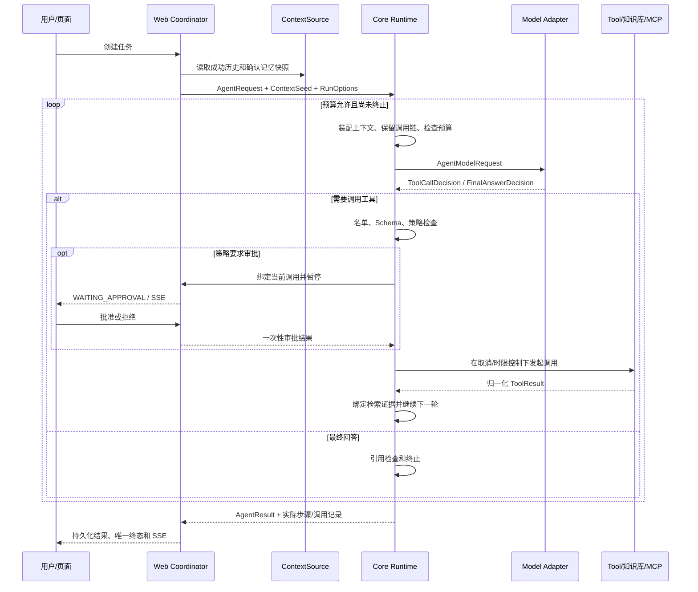

# 架构与真实执行顺序

## 自研与复用

项目自己实现 Agent 决策循环、Tool 协议和策略、上下文选择、确认记忆、RAG 引用绑定、MCP 工具映射、审批门禁及评测规则。Spring Boot、HTTP/SSE、JSON、数据库驱动、MCP SDK 和密码学设施负责通用基础设施；没有由 Agent 框架接管主循环。

拒绝、取消、预算耗尽和失败可提前退出循环，不会继续发起工具。审批通过表示允许当前调用，不表示副作用已经成功。调用发出后断连/取消可能产生 `UNKNOWN`，不自动重放。

## 模块边界

`agent-core` 没有 Spring、数据库、Redis、模型或 MCP SDK 依赖。`DefaultAgentRuntime` 持有模型、Registry、Executor、ContextAssembler、策略和时钟端口；每次调用携带请求和预算，核心类不管理 Web 会话。

`AgentRuntimeAutoConfiguration` 只组装对象，位于轻量 Starter。它后于 Tool/Policy/LLM/Web 的配置定义注册。非 Web 无 StepRecorder 时仍有核心内存步骤；Web 注册的 `JpaStepRecorder` 注入同一个 Runtime，实时记录和最终归并落库。

Web 的 `RunCoordinator` 管理单进程准入、取消、审批与最终持久化。`PersistentContextSource` 每次 Run 读取一次历史和确认记忆，随后每轮上下文装配使用同一快照。旧 chat 的 ShortTermMemory 不是确认记忆。

RAG 的源文档和快照在本地目录，向量在 Qdrant；Runtime 只接收受约束证据，由 EvidenceLedger 分配当前 Run 的引用编号，不能直接信任工具正文里的 `[S1]`。MCP 复用 SDK 传输并限制工具 Schema、名单与风险策略。版本支持 `2025-11-25` 和 `2025-06-18`，不代表兼容任意 MCP 服务。

## 可定位的代码

- [核心循环](../agent-core/src/main/java/com/agentflow/core/runtime/DefaultAgentRuntime.java)
- [上下文选择](../agent-core/src/main/java/com/agentflow/core/context/ContextAssembler.java)
- [证据绑定](../agent-core/src/main/java/com/agentflow/core/rag/EvidenceLedger.java)
- [Starter 装配](../agent-spring-boot-starter/src/main/java/com/agentflow/autoconfigure/AgentRuntimeAutoConfiguration.java)
- [Web 协调](../agent-web/src/main/java/com/agentflow/web/run/RunCoordinator.java)
- [MCP 适配](../agent-mcp/src/main/java/com/agentflow/mcp/SdkMcpClientOperations.java)
- [评测评分](../agent-eval/src/main/java/com/agentflow/eval/EvaluationScorer.java)

评测使用公开核心/HTTP 入口观察实际结果后评分，不从预期答案生成观察值。ERROR/NOT_RUN 的必需规则保留为 INCOMPLETE；未知 usage 不填零，Fixture token 不表示实际账单。
