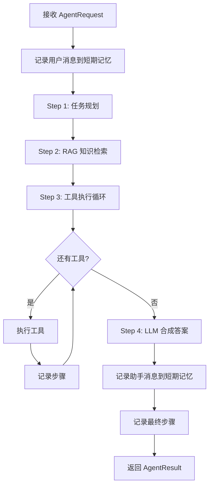
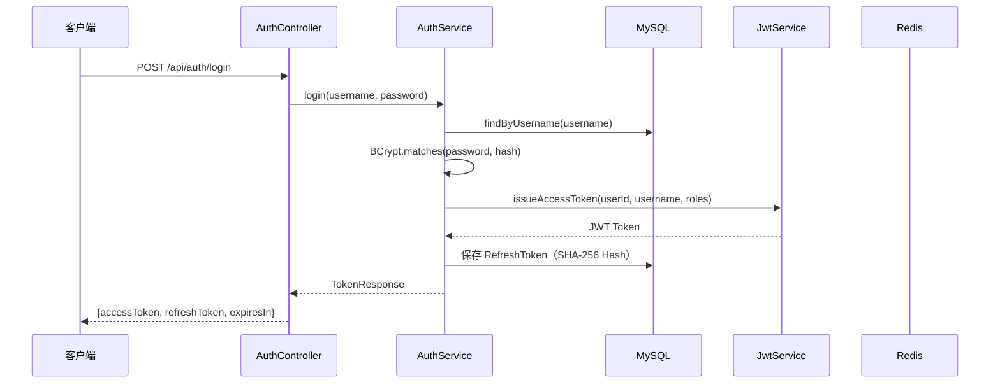
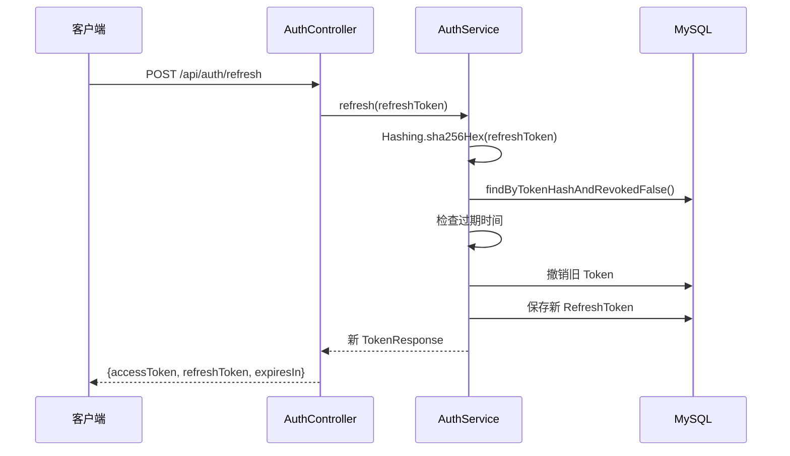
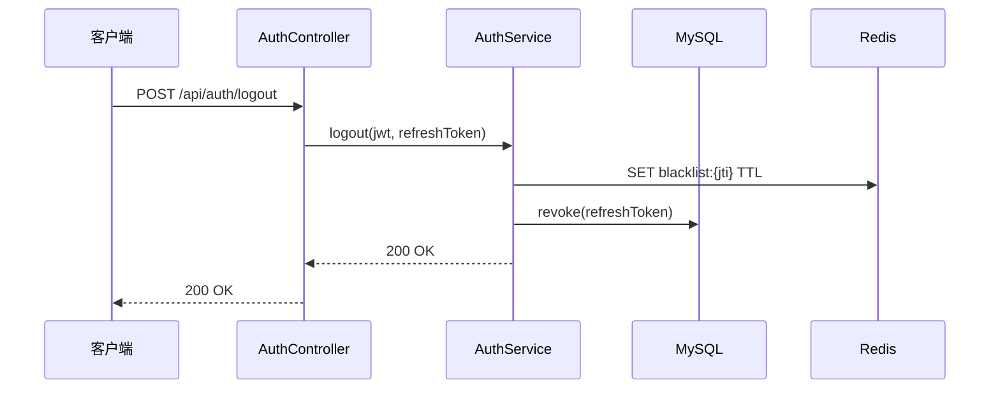
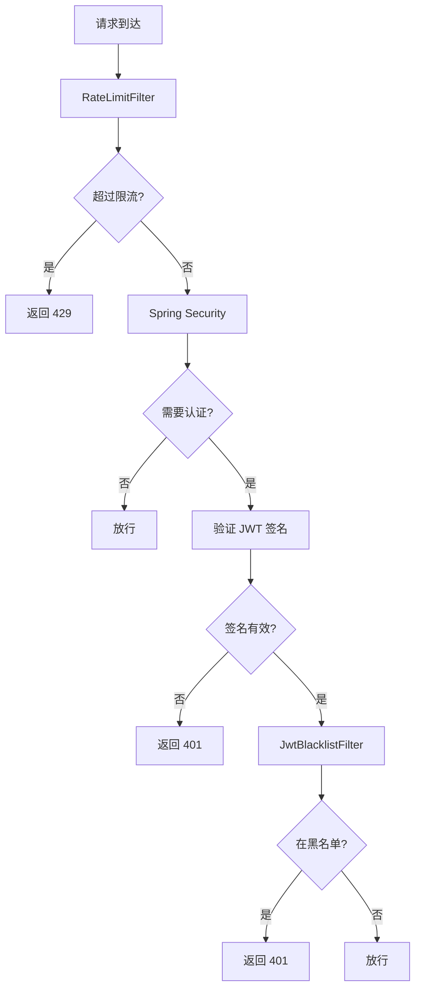

# 核心业务流程说明

## 1. 流程总览

AgentFlow-Java 的核心业务流程包括：

| 流程 | 入口 | 异步 | 说明 |
|------|------|------|------|
| Chat 对话 | `POST /api/chat` | 同步 | 直接调用 LLM |
| Chat 流式 | `POST /api/chat/stream` | SSE | 流式调用 LLM |
| Agent 任务 | `POST /api/agent/tasks` | 异步 | 完整 Agent 循环 |
| 事件订阅 | `GET /api/agent/tasks/{id}/events` | SSE | 实时事件推送 |
| 知识重载 | `POST /api/knowledge/reload` | 同步 | 重新索引知识库 |

## 2. Chat 对话流程

### 2.1 同步对话

**端点**：`POST /api/chat`

**调用链**：

```
ChatController.chat(ChatRequest)
  → ChatService.chat(request)
    → ShortTermMemory.recentMessages(sessionId, 20)     // 获取历史
    → ChatModelClient.complete(completionRequest)        // 调用 LLM
      → OpenAiCompatibleModelClient.complete()
        → RestClient.post("/chat/completions")
    → ShortTermMemory.appendUserMessage()                // 存储用户消息
    → ShortTermMemory.appendAssistantMessage()           // 存储助手消息
  → return ChatResponse
```

**代码依据**：
- `ChatController.java:29-31`
- `ChatService.java:29-33`
- `OpenAiCompatibleModelClient.java:56-75`

**请求示例**：

```json
{
  "message": "你好",
  "sessionId": "optional-session-id",
  "systemPrompt": "你是一个 Java 开发助手",
  "model": "deepseek-v4-pro",
  "temperature": 0.7,
  "maxTokens": 2000
}
```

**响应示例**：

```json
{
  "sessionId": "550e8400-e29b-41d4-a716-446655440000",
  "provider": "deepseek",
  "model": "deepseek-v4-pro",
  "content": "你好！我是 Java 开发助手，有什么可以帮你的？",
  "usage": {
    "promptTokens": 15,
    "completionTokens": 20,
    "totalTokens": 35
  },
  "mocked": false
}
```

### 2.2 流式对话

**端点**：`POST /api/chat/stream`

**调用链**：

```
ChatController.stream(ChatRequest)
  → 创建 SseEmitter（30 分钟超时）
  → 异步线程：
    → ChatService.stream(request, deltaConsumer)
      → ChatModelClient.stream(request, deltaConsumer)
        → OpenAiCompatibleModelClient.stream()
          → RestClient.exchange() 读取原始 SSE 流
          → 逐行解析 "data:" 前缀
          → 提取 choices[0].delta.content
          → deltaConsumer.accept(delta)
            → emitter.send("delta", {content: delta})
    → emitter.send("done", response)
    → emitter.complete()
  → 返回 SseEmitter
```

**代码依据**：
- `ChatController.java:33-47`
- `OpenAiCompatibleModelClient.java:78-118`

**SSE 事件格式**：

```
event: delta
data: {"content": "你"}

event: delta
data: {"content": "好"}

event: done
data: {"sessionId":"...","provider":"deepseek","model":"...","content":"你好","usage":{...},"mocked":false}
```

### 2.3 多轮对话机制

**历史管理**：
- 使用 `ShortTermMemory` 存储对话历史
- Redis 实现：`RedisShortTermMemory`，每个会话保留最近 20 条消息，TTL 12 小时
- 内存实现：`InMemoryShortTermMemory`，基于 ConcurrentHashMap

**消息格式**：
```
USER: 用户消息内容
ASSISTANT: 助手回复内容
```

**代码依据**：
- `RedisShortTermMemory.java:37-41`：`rightPush` + `trim(-20, -1)` + `expire(12h)`
- `ChatService.java:53-58`：历史消息解析

## 3. Agent 任务流程

### 3.1 任务创建

**端点**：`POST /api/agent/tasks`

**调用链**：

```
AgentController.createTask(jwt, request)
  → AgentTaskService.create(userId, input)
    → 生成 sessionId = UUID
    → 生成 taskId = UUID
    → 保存 AgentSessionEntity（JPA）
    → 保存 AgentTaskEntity（JPA，状态=RUNNING）
    → applicationTaskExecutor.execute(() -> execute(taskId))  // 异步执行
  → return TaskResponse(taskId, sessionId, "RUNNING")
```

**代码依据**：
- `AgentController.java:28-30`
- `AgentTaskService.java:39-46`

**请求示例**：

```json
{
  "input": "帮我设计一个秒杀系统的库存扣减接口"
}
```

**响应示例**：

```json
{
  "taskId": "550e8400-e29b-41d4-a716-446655440000",
  "sessionId": "660e8400-e29b-41d4-a716-446655440001",
  "status": "RUNNING"
}
```

### 3.2 Agent 执行循环

**核心方法**：`DefaultAgentRuntime.run(AgentRequest, AgentEventSink)`

**执行流程**：



**详细步骤**：

#### Step 1: 任务规划

```java
Plan plan = taskPlanner.plan(request.input(), toolRegistry.enabledToolNames());
```

**SimpleTaskPlanner 规则**：
- 包含 "sql"/"表"/"mysql"/"库存" → 选择 `sql-draft`
- 包含 "代码"/"controller"/"service"/"接口" → 选择 `code-draft`
- 默认选择 `interface-draft`
- 至少选择 2 个工具

**代码依据**：`SimpleTaskPlanner.java:17-36`

#### Step 2: RAG 知识检索

```java
List<RagDocument> documents = ragRetriever.retrieve(request.input(), 5);
```

**KnowledgeRagRetriever 流程**：
1. 使用 `EmbeddingClient.embed(query)` 将查询向量化
2. 调用 `QdrantClient.search(vector, limit)` 检索相似文档
3. 从 MySQL 查询 `KnowledgeChunkEntity` 获取完整内容
4. 如果 Qdrant 不可用，降级为关键词匹配

**代码依据**：`KnowledgeRagRetriever.java:32-49`

#### Step 3: 工具执行

```java
ToolContext toolContext = new ToolContext(taskId, sessionId, userId, documents);

for (String toolName : plan.toolNames().stream().limit(maxSteps).toList()) {
    Optional<AgentTool> tool = toolRegistry.findEnabled(toolName);
    if (tool.isEmpty()) {
        // 记录 SKIPPED 步骤
        continue;
    }
    ToolResult result = tool.get().execute(request.input(), toolContext);
    toolResults.add(result);
}
```

**工具执行特点**：
- 顺序执行，最多 `maxSteps` 个工具（默认 6）
- 工具未找到时记录 SKIPPED 步骤
- 每个工具执行都记录步骤和发布事件

**代码依据**：`DefaultAgentRuntime.java:75-86`

#### Step 4: LLM 合成

```java
String answer = modelClient.generate(buildFinalPrompt(request, documents, toolResults));
```

**Prompt 构建**：

```
System: 你是 AgentFlow-Java 的 AI Java 开发助手。
        你需要基于知识库和工具结果，输出工程化、可落地的后端设计方案。

User: 用户任务：{input}

      检索到的知识：
      - {文档1标题}: {文档1内容}
      - {文档2标题}: {文档2内容}

      工具执行结果：
      ## interface-draft
      {工具1输出}

      ## sql-draft
      {工具2输出}
```

**代码依据**：`DefaultAgentRuntime.java:98-121`

### 3.3 步骤记录

每一步执行都会：

1. **记录到数据库**（`JpaStepRecorder`）

```java
stepRecorder.record(AgentStepRecord.success(taskId, stepNo, type, name, input, output, latencyMs));
```

2. **发布事件**（`TaskEventPublisher`）

```java
sink.publish(AgentEvent.now(taskId, stepType, name, content));
```

3. **Redis 缓存**

```java
redisTemplate.opsForList().rightPush("agent:task:events:" + taskId, payload);
redisTemplate.opsForList().trim(key, -100, -1);  // 保留最近 100 条
redisTemplate.expire(key, Duration.ofHours(2));
```

4. **SSE 实时推送**

```java
for (SseEmitter emitter : emitters.get(taskId)) {
    emitter.send(SseEmitter.event().name(event.type().name()).data(payload));
}
```

**代码依据**：
- `JpaStepRecorder.java:19-21`
- `TaskEventPublisher.java:29-42`

### 3.4 事件订阅

**端点**：`GET /api/agent/tasks/{taskId}/events`

**调用链**：

```
AgentController.events(taskId)
  → AgentTaskService.subscribe(taskId)
    → TaskEventPublisher.subscribe(taskId)
      → 创建 SseEmitter（30 分钟超时）
      → Redis LRANGE 回放历史事件
      → 加入内存 emitter 列表
      → 注册 onCompletion/onTimeout 回调
  → 返回 SseEmitter
```

**SSE 事件格式**：

```
event: PLANNER
data: {"taskId":"...","type":"PLANNER","name":"planner","content":"识别为 Java 后端设计任务...","occurredAt":"..."}

event: RAG
data: {"taskId":"...","type":"RAG","name":"knowledge-retriever","content":"[{\"id\":\"...\",\"title\":\"...\",\"content\":\"...\",\"score\":0.95}]","occurredAt":"..."}

event: TOOL
data: {"taskId":"...","type":"TOOL","name":"interface-draft","content":"推荐接口：\n\nPOST /api/seckill/deduct...","occurredAt":"..."}

event: LLM
data: {"taskId":"...","type":"LLM","name":"final-answer","content":"基于秒杀系统的需求，我为您设计了以下方案...","occurredAt":"..."}

event: FINAL
data: {"taskId":"...","type":"FINAL","name":"FINAL","content":"基于秒杀系统的需求，我为您设计了以下方案...","occurredAt":"..."}
```

**代码依据**：`TaskEventPublisher.java:44-60`

### 3.5 任务状态查询

**端点**：`GET /api/agent/tasks/{taskId}`

**响应**：

```json
{
  "taskId": "...",
  "sessionId": "...",
  "status": "SUCCEEDED",
  "input": "帮我设计秒杀库存扣减接口",
  "finalAnswer": "基于秒杀系统的需求..."
}
```

**状态流转**：

```
RUNNING → SUCCEEDED
RUNNING → FAILED
```

**代码依据**：`AgentTaskEntity.java`

## 4. RAG 知识管理流程

### 4.1 知识加载

**触发方式**：
1. 应用启动时自动加载（`KnowledgeBootstrapConfig`）
2. 手动触发（`POST /api/knowledge/reload`）

**加载流程**：

```mermaid
flowchart TD
    A[读取 classpath:/knowledge/*.md] --> B{文件已存在?}
    B -->|是| C[跳过]
    B -->|否| D[计算内容 Hash]
    D --> E[保存 KnowledgeDocumentEntity]
    E --> F[分块处理]
    F --> G[保存 KnowledgeChunkEntity]
    G --> H{Qdrant 可用?}
    H -->|是| I[EmbeddingClient.embed()]
    I --> J[QdrantClient.upsert()]
    H -->|否| K[跳过向量化]
```

**分块策略**：
- 按空行分割段落
- 每块最大 1200 字符
- 超过时强制切分

**代码依据**：`KnowledgeService.java:44-79`

### 4.2 知识检索

**检索流程**：

```mermaid
flowchart TD
    A[接收查询] --> B[EmbeddingClient.embed(query)]
    B --> C[QdrantClient.search(vector, limit)]
    C --> D{有结果?}
    D -->|是| E[查询 MySQL 获取完整内容]
    E --> F[返回 RagDocument 列表]
    D -->|否| G[关键词降级匹配]
    G --> F
```

**降级策略**：
- 当 Qdrant 不可用或返回空结果时
- 遍历所有 `KnowledgeChunkEntity`
- 使用关键词匹配（"秒杀"/"库存"/"redis"/"mysql"等）
- 按匹配分数排序

**代码依据**：`KnowledgeRagRetriever.java:32-74`

## 5. 认证流程

### 5.1 登录流程



**代码依据**：`AuthService.java:44-52`

### 5.2 Token 刷新流程



**Token 轮换**：每次刷新都会撤销旧 Token 并签发新 Token。

**代码依据**：`AuthService.java:55-68`

### 5.3 登出流程



**代码依据**：`AuthService.java:71-82`

### 5.4 请求认证流程



**代码依据**：
- `SecurityConfig.java:37-48`
- `RateLimitFilter.java:25-39`
- `JwtBlacklistFilter.java`

## 6. 待确认项

| # | 项目 | 状态 | 说明 |
|---|------|------|------|
| 1 | 多轮 Agent 迭代 | 待确认 | 当前为单轮执行，是否支持反思-重试？ |
| 2 | 工具并行执行 | 待确认 | 当前为顺序执行，是否支持并行？ |
| 3 | 任务取消 | 待确认 | 是否支持取消正在执行的任务？ |
| 4 | 任务超时 | 待确认 | 是否支持任务执行超时？ |
| 5 | 任务重试 | 待确认 | 是否支持失败任务重试？ |
| 6 | 会话管理 | 待确认 | 是否支持会话删除、历史查询？ |
