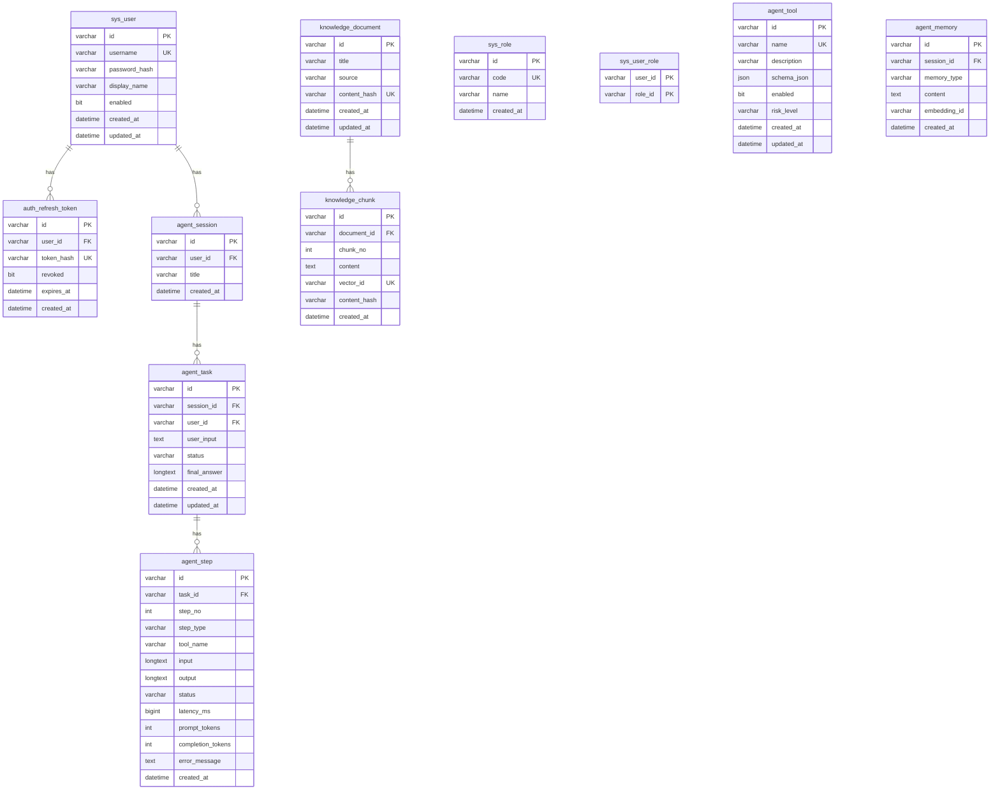

# 数据库设计说明

## 1. 概述

### 1.1 数据库选型

| 数据库 | 版本 | 用途 | 客户端 |
|--------|------|------|--------|
| MySQL | 8.4 | 持久化存储 | JPA + Hibernate |
| Redis | 7.4 | 缓存、会话、事件、限流 | StringRedisTemplate |
| Qdrant | v1.17.0 | 向量存储和检索 | RestClient |

### 1.2 数据库配置

**MySQL**：
- URL: `jdbc:mysql://localhost:3307/agentflow`
- 用户: `agentflow`
- DDL 管理: Flyway（`ddl-auto: none`）

**Redis**：
- 地址: `localhost:6379`
- 超时: 3 秒

**Qdrant**：
- 地址: `http://localhost:6333`
- 集合: `agentflow_knowledge`

**代码依据**：`application.yml`

---

## 2. MySQL 表结构

### 2.1 表清单

| 表名 | 说明 | JPA Entity |
|------|------|------------|
| `sys_user` | 系统用户 | `SysUser` |
| `sys_role` | 系统角色 | 无（预留） |
| `sys_user_role` | 用户角色关联 | 无（预留） |
| `auth_refresh_token` | 刷新令牌 | `AuthRefreshToken` |
| `agent_session` | Agent 会话 | `AgentSessionEntity` |
| `agent_task` | Agent 任务 | `AgentTaskEntity` |
| `agent_step` | Agent 步骤 | `AgentStepEntity` |
| `agent_tool` | 工具目录 | `AgentToolEntity` |
| `agent_memory` | 记忆存储 | 无（预留） |
| `knowledge_document` | 知识文档 | `KnowledgeDocumentEntity` |
| `knowledge_chunk` | 知识分块 | `KnowledgeChunkEntity` |

**代码依据**：`V1__init_schema.sql`

### 2.2 ER 图



### 2.3 表结构详情

#### 2.3.1 sys_user（系统用户）

```sql
CREATE TABLE sys_user (
    id VARCHAR(36) PRIMARY KEY,
    username VARCHAR(64) NOT NULL UNIQUE,
    password_hash VARCHAR(100) NOT NULL,
    display_name VARCHAR(100) NOT NULL,
    enabled BIT NOT NULL,
    created_at DATETIME(6) NOT NULL,
    updated_at DATETIME(6) NOT NULL
);
```

| 字段 | 类型 | 说明 |
|------|------|------|
| `id` | VARCHAR(36) | 主键，UUID |
| `username` | VARCHAR(64) | 用户名，唯一 |
| `password_hash` | VARCHAR(100) | BCrypt 密码哈希 |
| `display_name` | VARCHAR(100) | 显示名称 |
| `enabled` | BIT | 是否启用 |
| `created_at` | DATETIME(6) | 创建时间 |
| `updated_at` | DATETIME(6) | 更新时间 |

**JPA Entity**：`com.agentflow.web.auth.SysUser`

**初始数据**：
- 用户名: `admin`
- 密码: `agentflow123`
- 由 `InitialDataConfig` 启动时创建

**代码依据**：`InitialDataConfig.java`

---

#### 2.3.2 sys_role（系统角色）

```sql
CREATE TABLE sys_role (
    id VARCHAR(36) PRIMARY KEY,
    code VARCHAR(64) NOT NULL UNIQUE,
    name VARCHAR(100) NOT NULL,
    created_at DATETIME(6) NOT NULL
);
```

| 字段 | 类型 | 说明 |
|------|------|------|
| `id` | VARCHAR(36) | 主键，UUID |
| `code` | VARCHAR(64) | 角色代码，唯一 |
| `name` | VARCHAR(100) | 角色名称 |
| `created_at` | DATETIME(6) | 创建时间 |

**JPA Entity**：无（预留表）

**说明**：当前代码中未使用，角色硬编码为 `["USER"]`。

**代码依据**：`AuthService.java:85`

---

#### 2.3.3 sys_user_role（用户角色关联）

```sql
CREATE TABLE sys_user_role (
    user_id VARCHAR(36) NOT NULL,
    role_id VARCHAR(36) NOT NULL,
    PRIMARY KEY (user_id, role_id)
);
```

**JPA Entity**：无（预留表）

---

#### 2.3.4 auth_refresh_token（刷新令牌）

```sql
CREATE TABLE auth_refresh_token (
    id VARCHAR(36) PRIMARY KEY,
    user_id VARCHAR(36) NOT NULL,
    token_hash VARCHAR(128) NOT NULL UNIQUE,
    revoked BIT NOT NULL,
    expires_at DATETIME(6) NOT NULL,
    created_at DATETIME(6) NOT NULL
);
```

| 字段 | 类型 | 说明 |
|------|------|------|
| `id` | VARCHAR(36) | 主键，UUID |
| `user_id` | VARCHAR(36) | 关联用户 ID |
| `token_hash` | VARCHAR(128) | Token SHA-256 哈希 |
| `revoked` | BIT | 是否已撤销 |
| `expires_at` | DATETIME(6) | 过期时间 |
| `created_at` | DATETIME(6) | 创建时间 |

**JPA Entity**：`com.agentflow.web.auth.AuthRefreshToken`

**安全设计**：
- 存储 Token 的 SHA-256 哈希，不存储原始 Token
- 原始 Token 仅返回给客户端

**代码依据**：`AuthService.java:89-91`

---

#### 2.3.5 agent_session（Agent 会话）

```sql
CREATE TABLE agent_session (
    id VARCHAR(36) PRIMARY KEY,
    user_id VARCHAR(36) NOT NULL,
    title VARCHAR(200) NOT NULL,
    created_at DATETIME(6) NOT NULL
);
```

| 字段 | 类型 | 说明 |
|------|------|------|
| `id` | VARCHAR(36) | 主键，UUID |
| `user_id` | VARCHAR(36) | 关联用户 ID |
| `title` | VARCHAR(200) | 会话标题（用户输入前 48 字符） |
| `created_at` | DATETIME(6) | 创建时间 |

**JPA Entity**：`com.agentflow.web.agent.AgentSessionEntity`

**代码依据**：`AgentTaskService.java:43`

---

#### 2.3.6 agent_task（Agent 任务）

```sql
CREATE TABLE agent_task (
    id VARCHAR(36) PRIMARY KEY,
    session_id VARCHAR(36) NOT NULL,
    user_id VARCHAR(36) NOT NULL,
    user_input TEXT NOT NULL,
    status VARCHAR(32) NOT NULL,
    final_answer LONGTEXT NULL,
    created_at DATETIME(6) NOT NULL,
    updated_at DATETIME(6) NOT NULL
);
```

| 字段 | 类型 | 说明 |
|------|------|------|
| `id` | VARCHAR(36) | 主键，UUID |
| `session_id` | VARCHAR(36) | 关联会话 ID |
| `user_id` | VARCHAR(36) | 关联用户 ID |
| `user_input` | TEXT | 用户输入 |
| `status` | VARCHAR(32) | 任务状态（RUNNING/SUCCEEDED/FAILED） |
| `final_answer` | LONGTEXT | 最终答案 |
| `created_at` | DATETIME(6) | 创建时间 |
| `updated_at` | DATETIME(6) | 更新时间 |

**JPA Entity**：`com.agentflow.web.agent.AgentTaskEntity`

**状态流转**：
```
RUNNING → SUCCEEDED
RUNNING → FAILED
```

**代码依据**：`AgentTaskService.java:44`, `AgentTaskEntity.java`

---

#### 2.3.7 agent_step（Agent 步骤）

```sql
CREATE TABLE agent_step (
    id VARCHAR(36) PRIMARY KEY,
    task_id VARCHAR(36) NOT NULL,
    step_no INT NOT NULL,
    step_type VARCHAR(32) NOT NULL,
    tool_name VARCHAR(100) NULL,
    input LONGTEXT NULL,
    output LONGTEXT NULL,
    status VARCHAR(32) NOT NULL,
    latency_ms BIGINT NOT NULL,
    prompt_tokens INT NULL,
    completion_tokens INT NULL,
    error_message TEXT NULL,
    created_at DATETIME(6) NOT NULL,
    UNIQUE KEY uk_agent_step_task_no (task_id, step_no),
    INDEX idx_agent_step_task (task_id)
);
```

| 字段 | 类型 | 说明 |
|------|------|------|
| `id` | VARCHAR(36) | 主键，UUID |
| `task_id` | VARCHAR(36) | 关联任务 ID |
| `step_no` | INT | 步骤序号 |
| `step_type` | VARCHAR(32) | 步骤类型（PLANNER/RAG/TOOL/LLM/FINAL） |
| `tool_name` | VARCHAR(100) | 工具名称 |
| `input` | LONGTEXT | 步骤输入 |
| `output` | LONGTEXT | 步骤输出 |
| `status` | VARCHAR(32) | 步骤状态（SUCCESS/FAILED/SKIPPED） |
| `latency_ms` | BIGINT | 执行耗时（毫秒） |
| `prompt_tokens` | INT | 提示 Token 数 |
| `completion_tokens` | INT | 完成 Token 数 |
| `error_message` | TEXT | 错误信息 |
| `created_at` | DATETIME(6) | 创建时间 |

**JPA Entity**：`com.agentflow.web.agent.AgentStepEntity`

**索引**：
- `uk_agent_step_task_no`：(task_id, step_no) 唯一索引
- `idx_agent_step_task`：task_id 普通索引

**代码依据**：`JpaStepRecorder.java:19-21`

---

#### 2.3.8 agent_tool（工具目录）

```sql
CREATE TABLE agent_tool (
    id VARCHAR(36) PRIMARY KEY,
    name VARCHAR(100) NOT NULL UNIQUE,
    description VARCHAR(500) NOT NULL,
    schema_json JSON NULL,
    enabled BIT NOT NULL,
    risk_level VARCHAR(32) NOT NULL,
    created_at DATETIME(6) NOT NULL,
    updated_at DATETIME(6) NOT NULL
);
```

| 字段 | 类型 | 说明 |
|------|------|------|
| `id` | VARCHAR(36) | 主键，UUID |
| `name` | VARCHAR(100) | 工具名称，唯一 |
| `description` | VARCHAR(500) | 工具描述 |
| `schema_json` | JSON | 工具参数 Schema |
| `enabled` | BIT | 是否启用 |
| `risk_level` | VARCHAR(32) | 风险等级（LOW/MEDIUM/HIGH） |
| `created_at` | DATETIME(6) | 创建时间 |
| `updated_at` | DATETIME(6) | 更新时间 |

**JPA Entity**：`com.agentflow.demo.tool.AgentToolEntity`

**初始数据**：由 `InitialDataConfig` 启动时创建 3 个工具。

**代码依据**：`InitialDataConfig.java`

---

#### 2.3.9 agent_memory（记忆存储）

```sql
CREATE TABLE agent_memory (
    id VARCHAR(36) PRIMARY KEY,
    session_id VARCHAR(36) NOT NULL,
    memory_type VARCHAR(32) NOT NULL,
    content TEXT NOT NULL,
    embedding_id VARCHAR(100) NULL,
    created_at DATETIME(6) NOT NULL,
    INDEX idx_agent_memory_session (session_id)
);
```

**JPA Entity**：无（预留表）

**说明**：当前短期记忆使用 Redis 实现，此表为预留。

---

#### 2.3.10 knowledge_document（知识文档）

```sql
CREATE TABLE knowledge_document (
    id VARCHAR(36) PRIMARY KEY,
    title VARCHAR(200) NOT NULL,
    source VARCHAR(500) NOT NULL,
    content_hash VARCHAR(128) NOT NULL UNIQUE,
    created_at DATETIME(6) NOT NULL,
    updated_at DATETIME(6) NOT NULL
);
```

| 字段 | 类型 | 说明 |
|------|------|------|
| `id` | VARCHAR(36) | 主键，UUID |
| `title` | VARCHAR(200) | 文档标题 |
| `source` | VARCHAR(500) | 文档来源路径 |
| `content_hash` | VARCHAR(128) | 内容 SHA-256 哈希，唯一 |
| `created_at` | DATETIME(6) | 创建时间 |
| `updated_at` | DATETIME(6) | 更新时间 |

**JPA Entity**：`com.agentflow.demo.knowledge.KnowledgeDocumentEntity`

**去重逻辑**：按 `content_hash` 判断是否已存在。

**代码依据**：`KnowledgeService.java:54`

---

#### 2.3.11 knowledge_chunk（知识分块）

```sql
CREATE TABLE knowledge_chunk (
    id VARCHAR(36) PRIMARY KEY,
    document_id VARCHAR(36) NOT NULL,
    chunk_no INT NOT NULL,
    content TEXT NOT NULL,
    vector_id VARCHAR(100) NOT NULL UNIQUE,
    content_hash VARCHAR(128) NOT NULL,
    created_at DATETIME(6) NOT NULL,
    INDEX idx_knowledge_chunk_document (document_id),
    INDEX idx_knowledge_chunk_vector (vector_id)
);
```

| 字段 | 类型 | 说明 |
|------|------|------|
| `id` | VARCHAR(36) | 主键，UUID |
| `document_id` | VARCHAR(36) | 关联文档 ID |
| `chunk_no` | INT | 分块序号 |
| `content` | TEXT | 分块内容 |
| `vector_id` | VARCHAR(100) | 向量 ID（Qdrant point ID） |
| `content_hash` | VARCHAR(128) | 内容 SHA-256 哈希 |
| `created_at` | DATETIME(6) | 创建时间 |

**JPA Entity**：`com.agentflow.demo.knowledge.KnowledgeChunkEntity`

**索引**：
- `idx_knowledge_chunk_document`：document_id 普通索引
- `idx_knowledge_chunk_vector`：vector_id 普通索引

**代码依据**：`KnowledgeService.java:66-67`

---

## 3. Redis 数据结构

### 3.1 Key 清单

| Key 模式 | 类型 | 用途 | TTL |
|----------|------|------|-----|
| `auth:blacklist:{jti}` | String | JWT 黑名单 | Token 剩余有效期 |
| `auth:refresh:{userId}:{hash}` | String | 刷新令牌标记 | 7 天 |
| `rate:{ip}:{epochMinutes}` | String | IP 限流计数 | 2 分钟 |
| `memory:short:{sessionId}` | List | 短期对话记忆 | 12 小时 |
| `agent:task:events:{taskId}` | List | Agent 任务事件 | 2 小时 |

### 3.2 详细说明

#### 3.2.1 JWT 黑名单

```
Key:    auth:blacklist:{jti}
Value:  "1"
TTL:    Token 剩余有效期（秒）
用途:   登出时将 Access Token 的 JTI 加入黑名单
代码:   AuthService.java:75
```

#### 3.2.2 刷新令牌标记

```
Key:    auth:refresh:{userId}:{hashCode}
Value:  "1"
TTL:    7 天
用途:   标记用户有活跃的刷新令牌
代码:   AuthService.java:92-93
```

#### 3.2.3 IP 限流

```
Key:    rate:{ip}:{epochMinutes}
Value:  请求计数（自增）
TTL:    2 分钟
用途:   每分钟每 IP 最多 120 次请求
代码:   RateLimitFilter.java:31-38
```

#### 3.2.4 短期记忆

```
Key:    memory:short:{sessionId}
Value:  List<String>（消息列表）
TTL:    12 小时
用途:   存储对话历史，最多 20 条
代码:   RedisShortTermMemory.java:37-41
```

#### 3.2.5 任务事件

```
Key:    agent:task:events:{taskId}
Value:  List<String>（事件 JSON）
TTL:    2 小时
用途:   缓存 Agent 任务事件，支持断线回放
代码:   TaskEventPublisher.java:31-34
```

---

## 4. Qdrant 向量存储

### 4.1 集合配置

| 配置项 | 值 |
|--------|-----|
| 集合名 | `agentflow_knowledge` |
| 向量维度 | 2048 |
| 距离算法 | Cosine |

**代码依据**：`QdrantClient.java` + `application.yml`

### 4.2 数据结构

每个向量点包含：

| 字段 | 类型 | 说明 |
|------|------|------|
| `id` | UUID | 向量 ID |
| `vector` | float[2048] | 文本向量 |
| `payload.documentId` | String | 关联文档 ID |
| `payload.source` | String | 文档来源 |

**代码依据**：`KnowledgeService.java:69-70`

---

## 5. Flyway 迁移

### 5.1 迁移文件

| 文件 | 版本 | 说明 |
|------|------|------|
| `V1__init_schema.sql` | V1 | 初始化所有表结构 |

**位置**：`agent-demo/src/main/resources/db/migration/`

### 5.2 迁移策略

- `ddl-auto: none`：Hibernate 不自动创建表
- Flyway 在应用启动时自动执行迁移
- 迁移记录存储在 `flyway_schema_history` 表

**代码依据**：`application.yml`

---

## 6. 待确认项

| # | 项目 | 状态 | 说明 |
|---|------|------|------|
| 1 | `sys_role` / `sys_user_role` | 待确认 | 预留表，何时实现角色管理？ |
| 2 | `agent_memory` | 待确认 | 预留表，何时实现持久化记忆？ |
| 3 | 数据库连接池 | 待确认 | 是否配置 HikariCP？ |
| 4 | 读写分离 | 待确认 | 是否需要主从分离？ |
| 5 | 数据备份 | 待确认 | 是否有备份策略？ |
| 6 | 索引优化 | 待确认 | 是否需要更多索引？ |
