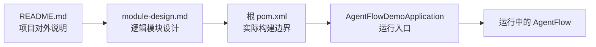
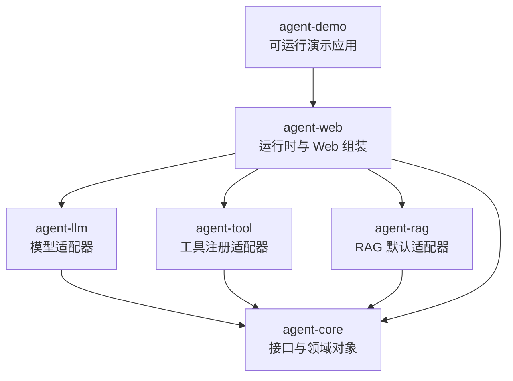
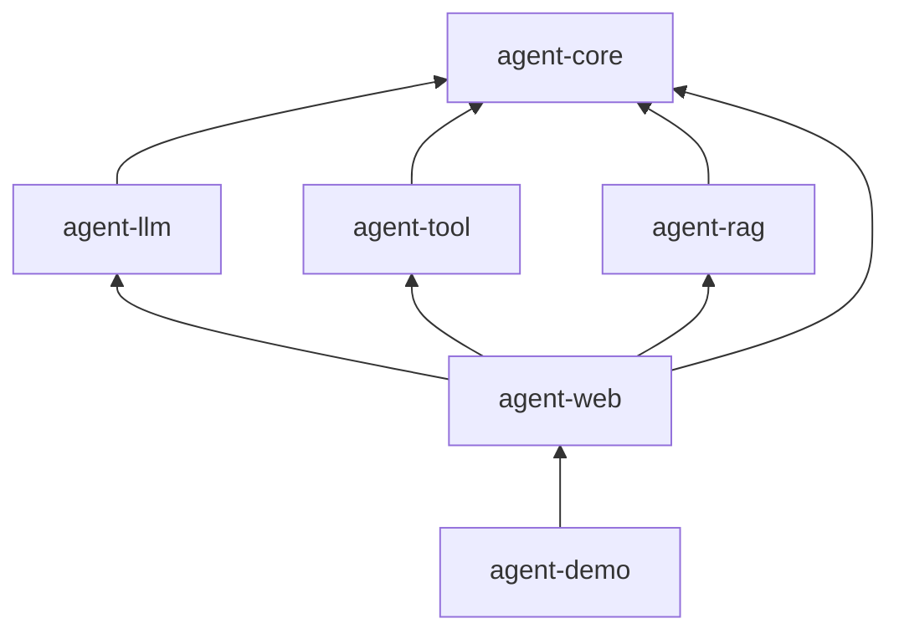
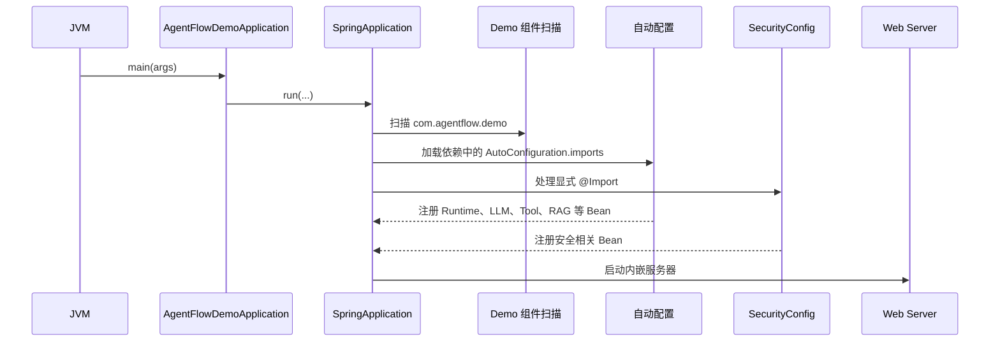
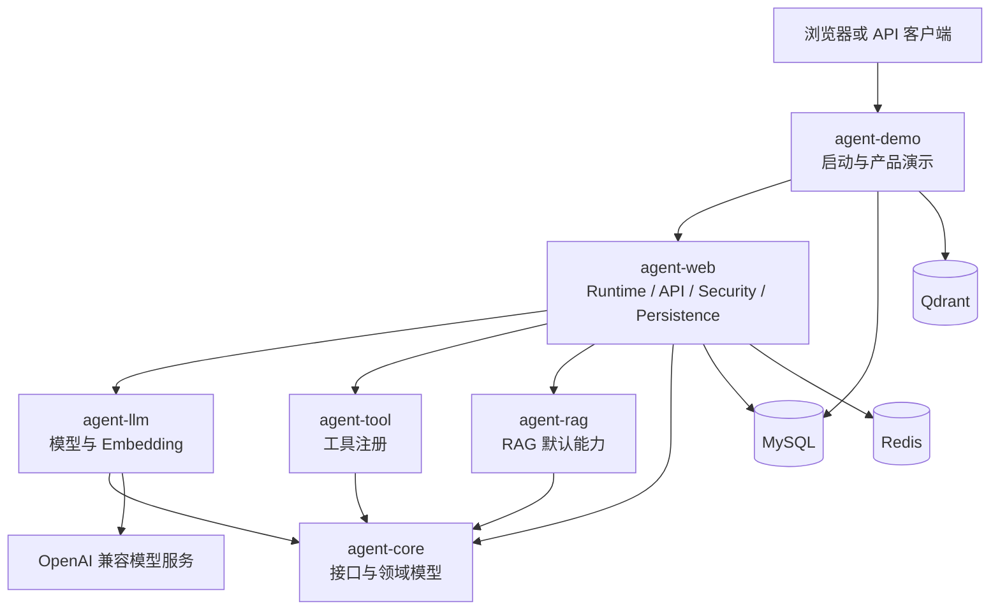

# 第 1 步：认识项目边界

这一课只学习四个入口文件：

1. [`README.md`](../../README.md)
2. [`docs/module-design.md`](../module-design.md)
3. [`pom.xml`](../../pom.xml)
4. [`AgentFlowDemoApplication.java`](../../agent-demo/src/main/java/com/agentflow/demo/AgentFlowDemoApplication.java)

它们不会告诉你 Agent 每一步具体怎样执行，但会先回答四个更基础的问题：

- 这个项目准备解决什么问题？
- 项目被拆成了哪些模块？
- Maven 如何组织和构建这些模块？
- 程序从哪里启动，Spring 如何把各模块装配起来？

学完本课后，再进入 `agent-core` 学习接口，才不会把一个类孤立地看成一段代码。

## 一、四个文件分别站在什么视角

| 文件 | 观察视角 | 主要回答的问题 |
| --- | --- | --- |
| `README.md` | 使用者视角 | 项目是什么、依赖什么、怎样运行和调用 |
| `docs/module-design.md` | 架构设计视角 | 为什么拆模块，每个模块负责什么 |
| 根 `pom.xml` | 构建系统视角 | Maven 实际识别哪些模块，版本如何统一 |
| `AgentFlowDemoApplication.java` | 运行时视角 | JVM 从哪里启动，Spring 上下文从哪里建立 |

可以把它们放在同一条线上理解：



阅读时要区分“文档描述”和“代码事实”：

```text
README / module-design.md：帮助理解设计意图
pom.xml / Java 源码：当前项目真正执行的事实
```

如果二者不一致，应以当前代码和构建配置为准，同时记录文档需要更新的地方。

## 二、`README.md`：先认识项目对外边界

### 2.1 文件职责

根 README 是项目给第一次访问仓库的人的说明书。它主要完成四件事：

1. 定义项目定位。
2. 列出关键技术和外部依赖。
3. 提供最短启动方式。
4. 给出一个最小 API 调用示例。

它适合建立全局印象，不适合用来研究内部实现细节。

### 2.2 项目定位

README 将 AgentFlow-Java 定义为：

```text
基于 Spring Boot 的 Java Agent Runtime MVP
        +
企业风格的后端基础能力
        +
最小 AI 开发助手示例
```

这里有两个关键词。

#### Runtime

Runtime 表示项目不只是调用一次大模型，而是试图统一编排：

- 用户请求
- 会话记忆
- 任务规划
- RAG 检索
- 工具调用
- 模型生成
- 执行步骤记录
- 事件推送

#### MVP

MVP 表示它是“最小可行实现”，不是成熟的通用 Agent 平台。学习时应同时关注：

- 已经建立了哪些扩展接口
- 哪些功能仍是简单实现或占位实现
- 哪些能力适合继续升级

不能仅因为项目用了 `Runtime`、`RAG`、`MCP` 等名称，就默认这些能力已经完整实现。

### 2.3 三类外部基础设施

README 给出了三个主要外部存储：

| 基础设施 | 当前职责 |
| --- | --- |
| MySQL | 用户、令牌、会话、任务、步骤、工具目录、知识元数据 |
| Redis | JWT 黑名单、限流计数、短期记忆、任务事件缓冲 |
| Qdrant | RAG 文档向量和相似度检索 |

建立一个简单记忆：

```text
MySQL 保存需要长期保留的业务数据
Redis 保存高频、短期或带过期时间的状态
Qdrant 保存用于语义检索的向量
```

README 还特别说明 MySQL 在宿主机映射为 `3307`，目的是避开本机已有的 `3306`
端口。这是部署细节，不是项目业务设计。

### 2.4 模型边界

项目支持 OpenAI 兼容接口，README 中展示了：

- DeepSeek
- OpenAI
- 自定义兼容服务

模型提供商通过环境变量配置，而不是写死在 Runtime 中。没有 API Key 时，模型客户端
返回确定性的本地兜底结果，因此可以先验证：

- Spring 是否能启动
- API 是否能调用
- 数据库流程是否连通
- 页面和事件流程是否工作

但本地兜底结果不能证明真实模型调用已经成功。

### 2.5 API 边界

README 展示了两种 Chat API：

```text
POST /api/chat
POST /api/chat/stream
```

前者同步返回完整结果；后者通过 SSE 推送：

- `delta`
- `done`
- `error`

`sessionId` 用于关联后续请求和最近的 Redis 对话历史。

### 2.6 README 中发现的一处不一致

README 当前给出的启动命令是：

```bash
mvn -pl agent-demo-dev-assistant -am spring-boot:run
```

但是根 POM 和 `agent-demo/pom.xml` 中的真实模块及构件名都是：

```text
agent-demo
```

因此按照当前仓库，更一致的写法应当是：

```bash
mvn -pl agent-demo -am spring-boot:run
```

也可以使用 Maven 的构件选择语法：

```bash
mvn -pl :agent-demo -am spring-boot:run
```

这是学习现有项目时很重要的一点：README 是入口，但不能替代对 POM 和源码的核对。

### 2.7 阅读 README 后应能回答

- 这个项目为什么不仅是一个普通聊天接口？
- MySQL、Redis 和 Qdrant 分别解决什么问题？
- 没有模型 API Key 时，哪些流程仍然可以验证？
- 同步 Chat 和 SSE Chat 的交互方式有什么差异？

## 三、`docs/module-design.md`：理解逻辑模块边界

### 3.1 文件职责

这份文档从设计者视角解释各模块的职责、接口、实现类和值对象。它比 README 更接近
源码，但仍然属于“设计说明”，其中的示例代码可能经过简化，也可能落后于当前实现。

当前根 POM 实际声明了六个 Maven 模块：

| 模块 | 核心职责 | 是否直接承载业务运行 |
| --- | --- | --- |
| `agent-core` | 领域协议、接口和值对象 | 否 |
| `agent-llm` | 模型、Embedding、Chat 适配 | 否 |
| `agent-tool` | 工具注册和工具提供机制 | 否 |
| `agent-rag` | 默认 RAG 适配与空实现 | 否 |
| `agent-web` | Runtime 组装、Web、认证、持久化 | 是 |
| `agent-demo` | 启动入口、示例工具、知识库、UI | 是 |

当前项目没有单独的 `agent-data` Maven 模块。数据实体、Repository、Redis Memory 和
步骤记录主要位于 `agent-web` 与 `agent-demo`。

### 3.2 核心设计：端口与适配器

项目希望把稳定协议和可变技术实现分开：



箭头表示“构建依赖”。例如 `agent-llm → agent-core` 的意思是 `agent-llm` 可以使用
`agent-core` 的接口，但 `agent-core` 不知道 `agent-llm` 的存在。

### 3.3 各模块怎样协作

#### `agent-core`

负责定义共同语言：

- `AgentRuntime`
- `AgentModelClient`
- `TaskPlanner`
- `RagRetriever`
- `AgentTool`
- `ToolRegistry`
- `ShortTermMemory`
- `StepRecorder`
- `AgentRequest`、`AgentResult`、`Plan`、`ToolResult` 等值对象

它不直接连接 OpenAI、Redis、MySQL 或 Qdrant。

文档总览表把它简写为“纯接口定义”，但更准确的描述是：

```text
接口协议 + record 值对象 + enum 状态定义
```

#### `agent-llm`

实现模型相关端口。当前 `OpenAiCompatibleModelClient` 同时承担：

- Agent 文本生成
- Chat 同步和流式生成
- Embedding

它将 OpenAI 兼容 HTTP API 的技术细节隔离在 Runtime 之外。

#### `agent-tool`

提供 `InMemoryToolRegistry`，负责注册和查找 `AgentTool`。具体的示例工具主要放在
`agent-demo`，因为工具通常带有具体业务含义。

`McpToolProvider` 当前仍是返回空集合的占位实现，不能把它理解为已经完成 MCP 集成。

#### `agent-rag`

提供 `NoopRagRetriever` 作为默认空实现。真正访问 Embedding、Qdrant 和知识分块的
`KnowledgeRagRetriever` 位于 `agent-demo`。

这说明 `agent-rag` 当前更像一个可扩展骨架，而不是完整知识库模块。

#### `agent-web`

这是当前项目最重的模块，负责：

- `DefaultAgentRuntime`
- REST Controller 和应用服务
- JWT 与 Spring Security
- JPA Entity、Repository 和步骤记录
- Redis 短期记忆与任务事件
- Spring Boot 自动配置

它既承担 Runtime 组装，又承担较多 Web 和数据适配职责。后续如果项目继续扩大，这里
可能需要进一步拆分。

#### `agent-demo`

负责把前面的模块组合成一个可以运行的产品示例，包括：

- Spring Boot 主类
- 三个示例 Agent Tool
- 知识库导入和检索
- 初始化管理员
- 静态 Web 页面

它是组合根和展示层，不应该成为所有通用能力的存放位置。

### 3.4 文档不是源码的替代品

`module-design.md` 中存在为了说明概念而简化的代码片段。例如文档里的工具自动配置
示例与当前源码的构造方式存在差异。因此建议使用以下可信度顺序：

```text
正在运行的测试和代码
  > pom.xml / application.yml
  > 架构文档
  > README 示例
```

这并不意味着文档没有价值，而是要把它当作“理解意图的地图”，再用源码验证。

### 3.5 阅读模块设计后应能回答

- 为什么 `agent-core` 不能反向依赖 `agent-llm`？
- 为什么具体演示工具放在 `agent-demo`，而工具注册表放在 `agent-tool`？
- `agent-rag` 当前为什么不能算完整 RAG 实现？
- `agent-web` 为什么是当前职责最重的模块？
- 什么代码适合成为通用模块，什么代码只适合留在 Demo？

## 四、根 `pom.xml`：理解真实构建边界

### 4.1 它同时是父 POM 和聚合 POM

根 POM 声明：

```xml
<packaging>pom</packaging>
```

这意味着根项目本身不生成普通 Java JAR。它主要承担两种职责。

#### 父 POM

子模块通过 `<parent>` 继承：

- `groupId`
- `version`
- Java 版本
- 依赖版本管理
- Maven 插件配置

#### 聚合 POM

根 POM 的 `<modules>` 决定一次 Reactor 构建包含哪些模块：

```xml
<modules>
    <module>agent-core</module>
    <module>agent-llm</module>
    <module>agent-tool</module>
    <module>agent-rag</module>
    <module>agent-web</module>
    <module>agent-demo</module>
</modules>
```

因此，“仓库里存在一个目录”不等于“它是 Maven 模块”；是否属于构建，首先看这里。

### 4.2 Spring Boot Parent

项目继承：

```xml
<artifactId>spring-boot-starter-parent</artifactId>
<version>3.5.14</version>
```

它主要提供：

- 常见依赖的兼容版本
- Maven 插件默认值
- Java 编译和资源处理约定
- Spring Boot 构建惯例

### 4.3 项目坐标

```xml
<groupId>com.agentflow</groupId>
<artifactId>agentflow-java</artifactId>
<version>0.1.0-SNAPSHOT</version>
```

- `groupId`：组织或命名空间。
- `artifactId`：当前构件名。
- `version`：版本。
- `SNAPSHOT`：仍处在持续开发阶段，不是固定发布版本。

### 4.4 统一版本属性

根 POM 统一声明 Java 17、Spring AI 1.1.6 和 Springdoc 2.8.14。子模块使用这些属性，
不需要各自重复写版本。这样升级时可以在一个地方修改。

版本号只能说明当前配置，不能自动证明它们是最新版本或彼此完全兼容；升级需要单独
检查发行说明并运行测试。

### 4.5 Spring AI BOM

`dependencyManagement` 导入了 Spring AI BOM：

```xml
<artifactId>spring-ai-bom</artifactId>
<type>pom</type>
<scope>import</scope>
```

BOM 的作用是统一一组 Spring AI 依赖的版本。要注意：

```text
dependencyManagement 管版本
dependencies 才真正引入依赖
```

根 POM 导入 BOM，并不代表每个模块都自动依赖所有 Spring AI 组件。

### 4.6 Spring Boot Maven Plugin

根 POM 默认设置：

```xml
<skip>true</skip>
```

目的是避免所有库模块都尝试打包成可启动 Spring Boot 应用。

`agent-demo/pom.xml` 再显式覆盖：

```xml
<skip>false</skip>
<mainClass>com.agentflow.demo.AgentFlowDemoApplication</mainClass>
```

所以最终由 `agent-demo` 生成可启动应用，其他模块保持普通库模块。

### 4.7 Maven 模块依赖关系

根 POM 只声明构建成员，真正的模块依赖在各子模块 POM 中：



`agent-demo` 只需要直接依赖 `agent-web`，Maven 会通过传递依赖带入
`agent-core`、`agent-llm`、`agent-tool` 和 `agent-rag`。

### 4.8 理解常用 Maven 参数

```bash
mvn -pl agent-demo -am spring-boot:run
```

- `-pl agent-demo`：只选择 `agent-demo` 作为目标项目。
- `-am`：同时构建它依赖的 Reactor 模块。
- `spring-boot:run`：运行 Spring Boot Maven Plugin。

### 4.9 阅读根 POM 后应能回答

- 为什么根项目的 `packaging` 是 `pom`？
- `<modules>` 和 `<dependencies>` 有什么区别？
- 为什么 `agent-demo` 能间接获得 `agent-core`？
- BOM 与普通 dependency 有什么区别？
- 为什么只有 `agent-demo` 应生成可启动应用？

## 五、`AgentFlowDemoApplication.java`：理解运行时边界

### 5.1 这是 JVM 启动入口

主方法只有一行核心代码：

```java
SpringApplication.run(AgentFlowDemoApplication.class, args);
```

它会创建并启动 Spring ApplicationContext，随后完成：

- 读取配置和环境变量
- 执行组件扫描
- 加载自动配置
- 创建 Spring Bean
- 启动内嵌 Web Server
- 执行启动初始化任务

### 5.2 `@SpringBootApplication`

这个组合注解可以近似理解为：

```text
Spring Boot 配置入口
+ 自动配置
+ 组件扫描
```

因为主类位于 `com.agentflow.demo`，默认组件扫描范围是 `com.agentflow.demo` 及其子包。
因此示例工具、知识库组件和 Demo 初始化配置能够被扫描到。

### 5.3 各库模块如何进入 Spring 上下文

`agent-llm`、`agent-tool`、`agent-rag` 和 `agent-web` 都提供：

```text
META-INF/spring/
org.springframework.boot.autoconfigure.AutoConfiguration.imports
```

其中分别登记：

- `AgentLlmAutoConfiguration`
- `AgentToolAutoConfiguration`
- `AgentRagAutoConfiguration`
- `AgentWebAutoConfiguration`

Spring Boot 会从依赖 JAR 中发现这些自动配置，所以主类不需要逐个 `new` 出 Runtime、
模型客户端、工具注册表和 RAG 检索器。

### 5.4 为什么显式 `@Import(SecurityConfig.class)`

`SecurityConfig` 位于 `com.agentflow.web.config`，不在 Demo 默认扫描包下面，并且它没有
作为独立 AutoConfiguration 登记。因此启动类使用：

```java
@Import(SecurityConfig.class)
```

将安全过滤链、JWT 编解码器和密码编码器显式加入应用上下文。

`@Import` 的含义不是“导入一个 Java 文件”，而是让 Spring 把这个配置类纳入 Bean
定义处理。

### 5.5 启动流程



### 5.6 一个需要后续运行验证的边界问题

当前代码没有发现针对整个 `com.agentflow` 的 `@ComponentScan`。默认扫描只覆盖
`com.agentflow.demo`，而部分 Controller、Service、JPA Entity 和 Repository 位于
`com.agentflow.web`。

自动配置能够注册它明确声明的 Bean，但不会天然等价于扫描 `com.agentflow.web` 下的
所有 `@Component`。当前启动类只额外导入了 `SecurityConfig`。

因此后续实际启动项目时，应重点验证：

- `AgentController`、`ChatController`、`AuthController` 是否进入上下文
- `AgentTaskService`、`AuthService`、`ChatService` 是否成为 Bean
- `com.agentflow.web` 下的 Repository 和 Entity 是否被扫描

这是从代码边界推导出的待验证风险。完成运行验证前，不应仅凭 README 判断所有接口
一定已经成功暴露。

### 5.7 阅读启动类后应能回答

- 为什么真正的可启动模块是 `agent-demo`？
- `@SpringBootApplication` 做了哪些事情？
- 为什么需要显式导入 `SecurityConfig`？
- 自动配置和普通组件扫描有什么区别？
- 一个依赖 JAR 出现在 classpath 中，是否意味着它的所有组件都会自动成为 Bean？

## 六、把四个文件合并成一张项目边界图



这张图表达了项目的第一层边界：

- `agent-core` 位于稳定中心。
- `agent-llm`、`agent-tool`、`agent-rag` 是能力适配模块。
- `agent-web` 负责运行时和 Web 组装。
- `agent-demo` 是启动入口和具体演示产品。
- MySQL、Redis、Qdrant、模型 API 都属于进程外部依赖。

## 七、本课建议学习过程

预计用时：60～90 分钟。

### 第一次阅读：只看全局

1. 阅读 README 的项目定位和技术清单。
2. 阅读 `module-design.md` 的模块总览。
3. 找出根 POM 的 `<modules>`。
4. 阅读启动类的三个注解和 `main()`。

目标：不深入任何业务类，先画出六模块关系。

### 第二次阅读：核对文档和代码

1. 用根 POM 核对模块数量。
2. 用子模块 POM 核对依赖方向。
3. 用 `AgentFlowDemoApplication` 核对真正启动模块。
4. 找出各模块的 `AutoConfiguration.imports`。
5. 记录 README 与 POM 的模块名不一致。

目标：建立“文档提供意图，构建与源码提供事实”的习惯。

### 第三次复述：脱离文档

关闭文件，用自己的话回答：

```text
AgentFlow 是什么？
为什么拆成六个模块？
哪个模块最稳定？
哪个模块真正启动？
外部依赖有哪些？
Spring 如何发现各模块提供的 Bean？
```

如果回答不出来，再回到对应章节，而不是从头重读所有文件。

## 八、自测题

### 题目 1

根 POM 中出现六个 `<module>`，是否意味着六个模块都会独立启动？

<details>
<summary>参考答案</summary>

不会。它们都参加 Maven Reactor 构建，但只有 `agent-demo` 配置了主类并启用 Spring
Boot Maven Plugin。其他模块主要作为依赖库。

</details>

### 题目 2

为什么 `agent-core` 不应该依赖 `agent-llm`？

<details>
<summary>参考答案</summary>

`agent-core` 定义稳定协议，`agent-llm` 是可替换的模型技术实现。如果核心反向依赖
模型模块，替换模型实现会影响核心，违反依赖倒置方向。

</details>

### 题目 3

README、`module-design.md` 和 POM 冲突时应该相信谁？

<details>
<summary>参考答案</summary>

以当前构建配置、源码和测试结果为准，同时修正文档。README 和设计文档用于解释意图，
但可能落后于代码。

</details>

### 题目 4

根 POM 导入 Spring AI BOM，是否意味着 `agent-core` 自动获得 Spring AI 依赖？

<details>
<summary>参考答案</summary>

不是。BOM 只管理版本；模块还必须在自己的 `<dependencies>` 中显式声明依赖。
`agent-core` 当前没有生产环境 Spring AI 依赖。

</details>

### 题目 5

`agent-demo` 为什么只直接依赖 `agent-web`，仍然可以获得其他 Agent 模块？

<details>
<summary>参考答案</summary>

因为 `agent-web` 直接依赖 `agent-core`、`agent-llm`、`agent-tool` 和 `agent-rag`，
Maven 会把它们作为传递依赖加入 `agent-demo` 的运行 classpath。

</details>

### 题目 6

`@Import(SecurityConfig.class)` 解决了什么问题？

<details>
<summary>参考答案</summary>

`SecurityConfig` 位于 Demo 默认组件扫描范围之外。`@Import` 显式将该配置类及其 Bean
定义加入当前 Spring ApplicationContext。

</details>

### 题目 7

为什么说项目目前是 Agent Runtime MVP，而不是完整自主 Agent 平台？

<details>
<summary>参考答案</summary>

它已经具备规划、RAG、工具、模型、记忆、步骤和事件等框架接口，但部分能力仍是简单
规则、空实现或 Demo 实现，例如 MCP Provider 和默认 RAG；完整自主决策循环也需要
后续继续演进。

</details>

## 九、完成标准

完成本课后，应当能够不看源码画出六模块依赖图，并用自己的话说明：

1. 项目的目标用户和主要能力。
2. 六个 Maven 模块各自的责任。
3. 为什么 `agent-core` 位于依赖中心。
4. 为什么 `agent-demo` 是组合根和启动入口。
5. MySQL、Redis、Qdrant 和模型 API 的系统边界。
6. Maven 聚合、模块依赖和 Spring 自动配置之间的区别。
7. 当前文档与源码中至少两处需要核对或修正的地方。

达到这些标准后，再进入“第 2 步：学习核心接口”，开始阅读 `AgentRequest`、
`AgentResult`、`AgentRuntime` 以及模型、RAG、工具、规划、记忆和步骤记录端口。
