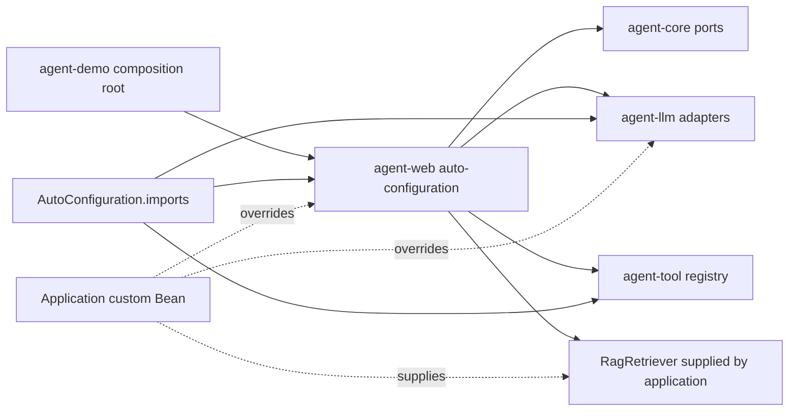

# Implementation Plan: 工程基线与 Starter 边界

**Branch**: `feature/001-engineering-baseline-starter`（当前实施分支；既有工作区改动按 T001 归属保留） | **Date**: 2026-09-01 |
**Spec**: [spec.md](spec.md)

**Input**: Feature specification from
`/specs/001-engineering-baseline-starter/spec.md`

## Summary

Feature 001 建立后续 Agent Feature 可以信任的工程基线：仓库使用固定 Maven Wrapper 和
同一条不依赖外部运行服务的验证命令；GitHub Actions 在 Java 17 上执行同一门禁；各模块
通过精确自动配置加载并允许应用 Bean 覆盖；Demo 在不访问真实模型、MySQL、Redis 或
Qdrant 的测试环境中证明完整上下文、Repository、Runtime 和 11 个临时 HTTP 操作确实可用。

本 Feature 同时移除活跃生产路径中的本地聊天答案、确定性向量、Noop RAG 和 Noop 步骤
记录等伪成功语义。缺少真实能力时改为明确失败或不注册能力，不新增 Agent 算法。为避免
项目完成时落在已经结束 OSS 维护的技术线上，兼容性迁移将作为独立 Phase 升级到当前稳定
Spring Boot 4.1.1；未被源码使用的 Spring AI Starter 将移除，只记录 Spring AI 2.0.1
作为后续 Feature 重新评估的当前候选，本 Feature 不声明支持或兼容。

## Technical Context

**Language/Version**: Java 17；编译目标与 CI 运行时固定为 Java 17。

**Primary Dependencies**: Maven 3.9.16（由官方 Wrapper 固定）、Spring Boot 4.1.1、Spring Framework 7
（由 Boot 管理）、springdoc-openapi 3.1.0、JUnit 5、Spring Boot Test、AssertJ、
Mockito、ArchUnit（仅测试范围）。

**Compatibility Reference**: Spring AI 2.0.1 只作为后续 Feature 的当前候选版本；当前没有
源码使用其类型，因此不保留运行依赖，也不声明已验证兼容。

**Storage**: 不新增存储。Demo 上下文测试使用 H2 内存数据库验证现有 JPA 装配；MySQL、
Redis 和 Qdrant 只作为现有交互 Demo 的可选外部设施，不进入默认验证门禁。

**Testing**: 纯 JUnit/ArchUnit 核心边界测试；`ApplicationContextRunner` 自动配置测试；
`@SpringBootTest` + H2 完整 Demo 上下文测试；MockMvc 临时入口注册与基本分发测试；
`MockRestServiceServer` 离线模型适配器测试。

**Target Platform**: Linux x86_64 为 CI 和主要开发环境；Wrapper 同时提交 Windows
`mvnw.cmd`。V1 仍是单进程模块化应用。

**Project Type**: 混合型多模块项目：纯 Java 核心库、Spring/模型/Tool/RAG 适配模块、
Web 传输模块和一个可运行 Demo。

**Performance Goals**: 依赖已缓存的正常开发环境中，`./mvnw -B -ntp clean verify`
应在 10 分钟内完成；CI job 超时上限 15 分钟。本 Feature 不规定 Agent 请求延迟或吞吐。

**Constraints**:

- 默认验证不得读取真实模型 Key，不得访问付费模型或要求 Docker 服务。
- 11 个现有 HTTP 操作全部是临时 Demo 快照，不形成稳定兼容承诺。
- Boot 4 迁移必须独立成 Phase 和提交，不与模型失败语义或自动配置行为修改混在一起。
- `DefaultAgentRuntime` 的算法和所在模块不在本 Feature 迁移。
- 用户现有脏工作区必须保留；实施前只对明确路径建分支和分阶段暂存。

**Scale/Scope**: 6 个现有 Maven 模块、1 个 Demo 应用、11 个临时 HTTP 操作、单 JDK
验证矩阵；不加入微服务、分布式执行、真实基础设施集成测试或产品级前端。

**Self-Built Agent Components**: 本 Feature 不新增 Agent Runtime、Tool、记忆、RAG 或 MCP
算法。项目自有内容仅包括装配约束、端口覆盖规则、适配器失败语义和架构门禁；现有
Runtime 行为保持不变。

**Reused Commodity Infrastructure**: 官方 Maven Wrapper、GitHub Actions、Spring Boot
自动配置与测试工具、Spring RestClient、Jackson 3、JUnit、Mockito、AssertJ、ArchUnit
和 H2。

**Framework Comparison/Boundary**: Spring Boot 只负责生命周期和 Bean 装配；Spring AI 不
接管主循环，也不进入 `agent-core`。当前 OpenAI-compatible 连接器继续使用 RestClient。
`agent-core` 生产字节码只能依赖核心自身与允许的 JDK 包，禁止 Spring、JPA、Redis、
Qdrant、厂商 SDK 和 HTTP 客户端类型。

**Portfolio Evidence**: 可讲解从 `AutoConfiguration.imports`、条件 Bean、应用覆盖到
`AgentRuntime` 注入的装配链；可运行统一验证和完整 Demo 上下文；保留 6 模块构建、
11 路由注册、覆盖退让、纯核心依赖和缺 Key 明确失败的自动化证据。

## Constitution Check

*GATE: Phase 0 前检查，Phase 1 设计完成后再次检查。*

### Pre-design

| Gate | Result | Evidence |
| --- | --- | --- |
| Feature boundary | PASS | 规格已授权独立 Boot 4 迁移；Runtime、Run/SSE、RAG 新语义、MCP、最终 Starter 均延期 |
| Agent ownership | PASS | 不修改核心循环；Spring AI 不进入 `agent-core` |
| Build versus reuse | PASS | 项目实现边界规则，复用 Wrapper、Boot 测试、HTTP/JSON 和 CI |
| Modules and assembly | PASS with approved exception | 适配器仍在对应模块，Demo 只作组合根；Runtime 暂留 Web 的例外见下文 |
| Test first | PASS | 行为修复先写失败测试；纯构建迁移执行直接兼容性验证 |
| Safety and truthfulness | PASS | 删除伪回答/伪向量/Noop 成功，凭据改由环境或测试配置提供 |
| Portfolio simplicity | PASS | 单 CI job、无外部服务、无新企业基础设施 |

### Post-design

除下方已批准的临时架构例外外，设计门禁全部通过。Boot 4 迁移被隔离为独立 Phase；未新增
核心算法、稳定 API、数据模型或 Starter 模块。

### Approved Transitional Exception

宪法要求 `agent-core` 拥有纯 Java Runtime，这是目标架构。本 Feature 经明确批准一个仅限过渡期的例外：现有 `DefaultAgentRuntime` 暂留在 `agent-web`，Feature 001 不迁移其算法或模块归属。
- Justification：在本 Feature 迁移 Runtime 会提前实施 Feature 002，扩大当前范围并改变 Agent 行为。
- Risk：在例外存续期间，纯 `agent-core` 仍不提供最终 Runtime，后续消费者必须等待 Feature 002。
- Expiry/removal：例外在 Feature 002 完成时到期；Feature 002 必须把 Runtime 迁入 `agent-core` 并重新验证核心边界。
- Scope：本例外不允许向 `agent-core` 引入 Spring、数据库、Redis、HTTP 或模型 SDK，也不允许新增 Runtime 能力。
- Approval：本 Feature 用户已明确同意按该临时例外推进（2026-09-02）。

## Project Structure

### Documentation (this Feature)

```text
specs/001-engineering-baseline-starter/
├── spec.md
├── plan.md
├── research.md
├── quickstart.md
├── checklists/
│   └── requirements.md
├── verification.md       # 实施完成后记录真实命令和结果
└── tasks.md              # 已生成；Phase 6 收尾后记录最终状态
```

`data-model.md` 被跳过，因为本 Feature 不新增或修改领域数据。`contracts/` 被跳过，
因为澄清结果已规定全部 HTTP 操作为临时 Demo，稳定 Run/SSE 契约由 Feature 003 定义。

### Source Code (repository root)

```text
.
├── mvnw
├── mvnw.cmd
├── .mvn/wrapper/maven-wrapper.properties
├── .github/workflows/verify.yml
├── .env.example
├── docker-compose.yml
├── pom.xml
├── agent-core/
│   ├── pom.xml
│   ├── src/main/java/com/agentflow/core/  # 现有纯 Java 端口和值对象
│   └── src/test/java/com/agentflow/core/architecture/
├── agent-llm/
│   ├── pom.xml
│   └── src/{main,test}/java/com/agentflow/llm/
├── agent-tool/
│   └── src/test/java/com/agentflow/tool/
├── agent-rag/
│   └── src/{main,test}/java/com/agentflow/rag/
├── agent-web/
│   └── src/{main,test}/java/com/agentflow/web/
├── agent-demo/
│   ├── pom.xml
│   ├── src/main/java/com/agentflow/demo/config/InitialDataConfig.java
│   ├── src/main/resources/application.yml
│   ├── src/main/resources/static/index.html
│   └── src/test/{java,resources}/
└── docs/
    ├── architecture.md
    ├── api/rest-api.md
    ├── configuration.md
    ├── database.md
    ├── deployment.md
    ├── module-design.md
    └── testing.md
```

**Structure Decision**:

- 根目录只承载构建入口、CI、环境变量示例和跨模块版本门禁。
- `agent-core` 只新增测试范围的架构规则，不加入 Spring。
- `agent-llm` 负责真实模型传输、每个模型端口的覆盖语义及适配器本地异常。
- `agent-rag` 删除静默 Noop 默认值；真正 RAG 仍由 Demo 当前实现提供，Feature 005 再
  设计可信检索。
- 当前位于 `agent-llm` 的 `AgentFlowProperties` 同时包含 Model、Tools、Security 和 MCP
  配置，是已知临时跨模块边界。本 Feature 只移除其中的生产默认凭据，不在此拆分类；
  Runtime/Tool 配置由 Feature 002、MCP 配置由 Feature 006、最终 Spring 配置组织由
  Feature 008 收口。
- `agent-web` 保留现有精确导入修复，只把可替换实现改为条件 Bean，并删除 Noop 记录器。
- `agent-demo` 提供完整消费方启动证据，不承载可复用逻辑。
- 不创建 Starter 模块；Feature 008 才根据真实使用面聚合最小依赖。
- `JpaStepRecorder` 和 `RedisShortTermMemory` 不再通过 `@Component`、`@Primary` 或 `@Import`
  注册；`JpaStepRecorder` 由自动配置中的一个条件 `@Bean` 创建，`RedisShortTermMemory` 在本
  Feature 不自动注册，只允许应用显式提供，避免外部服务和重复候选。

## Design Decisions

### Project-Owned Mechanisms

本 Feature 没有新的 Agent 算法。项目拥有并测试的是以下工程语义：

1. 每个核心端口的应用覆盖规则与唯一 Bean 不变量。
2. 缺少模型/RAG/记录能力时不得伪造成功的失败不变量。
3. `agent-core` 的纯 Java 依赖边界。
4. 当前临时 HTTP 操作的注册快照。

这些规则直接保护后续自研 Agent 机制，但不替代 Feature 002 的 Runtime 设计。

### Adapter and Integration Decisions

#### Compatibility migration is isolated

目标版本和官方依据记录在 [research.md](research.md)。实施时先建立 Wrapper 和当前基线
验证，再在兼容性 Phase 内按官方建议验证最新 3.5.x，最后迁移到 Boot 4.1.1/springdoc
3.1.0，包括 Spring Boot 上游依赖 Starter 的模块化调整、Flyway 依赖和 Jackson 3 包名调整。
该 Phase 只恢复现有行为和测试，不创建或拆分 HiAgent Starter/模块，也不同时修改伪成功语义；
3.5.x 中间版本仅用于降低迁移诊断难度，不形成发布承诺。

当前源码没有 `org.springframework.ai` 引用。因此删除未使用的
`spring-ai-starter-model-openai` 及无实际管理对象的 BOM，修正文档中“已集成 Spring AI”
的错误表述；research 记录 Spring AI 2.0.1 为后续真正引入时重新评估的当前候选。

#### One reproducible build entry

- 官方 Wrapper 固定 Maven 3.9.16，采用 `only-script`，提交脚本、Windows 脚本和
  `maven-wrapper.properties`，并记录发行包 SHA-256。
- 根 POM 在 `validate` 阶段校验 Java 17 和 Maven 3.9.x；Wrapper 负责精确版本。
- 本地与 CI 唯一完整门禁均为 `./mvnw -B -ntp clean verify`。
- CI 使用只读仓库权限、Temurin 17、Maven 缓存、15 分钟超时，并在 `push` 和
  `pull_request` 事件上运行；不配置 secrets、service containers 或网络模型调用。

#### Explicit auto-configuration chain



非可替换的 Controller/Service 可以继续精确 `@Import`。可替换端口必须由
`@Bean + @ConditionalOnMissingBean(接口.class)` 注册，不依靠 `@Primary` 抢占：

| Port | Default for this Feature | Application override | Missing behavior |
| --- | --- | --- | --- |
| `AgentModelClient` | OpenAI-compatible adapter | Custom Bean wins | First use throws explicit provider/configuration error |
| `ChatModelClient` | OpenAI-compatible adapter | Custom Bean wins | First use throws explicit provider/configuration error |
| `EmbeddingClient` | OpenAI-compatible adapter | Custom Bean wins | First use throws explicit provider/configuration error |
| `ToolRegistry` | In-memory registry over actual `AgentTool` Beans | Custom registry wins | Empty registry truthfully reports no tools |
| `RagRetriever` | No framework default | Demo/application supplies real implementation | Current Runtime assembly fails clearly because this port is required |
| `TaskPlanner` | Existing simple planner | Custom planner wins | N/A |
| `StepRecorder` | Existing JPA recorder in Web composition | Custom recorder wins | No Noop recorder is created |
| `ShortTermMemory` | `InMemoryShortTermMemory`（无外部服务的默认实现） | Custom memory wins；`RedisShortTermMemory` 在本 Feature 只允许由应用显式提供 | No hidden competing `@Primary` |
| `AgentRuntime` | Existing temporary `DefaultAgentRuntime` | Custom runtime wins | Missing required port prevents Agent assembly |

当前单个 `OpenAiCompatibleModelClient` 同时暴露三个接口，会在只覆盖其中一个接口时形成
候选歧义。实现应把共享 HTTP 传输与三个端口适配 Bean 分开，使每个条件独立生效；第三方
类型不得进入核心接口。T014 的现有请求/失败测试必须随拆分迁移到三个最终适配器测试类，
不能在共享传输类被移除端口后留下失效或未覆盖的旧测试。

#### Truthful failure instead of production fixtures

- 缺少 API Key 时，chat、stream 和 embedding 在任何网络调用前抛出带原因的
  `agent-llm` 本地异常。
- HTTP 错误、空响应、空内容和无效 embedding 响应均失败，不再生成本地答案或 SHA-256
  向量。
- 确定性模型和 embedding 只能放在 `src/test` Fixture。
- 删除 `NoopRagRetriever` 的自动注册；没有真实 RAG 时不产生“正常空命中”。
- 删除 `NoopStepRecorder` 默认路径；Demo 使用真实 JPA recorder，应用 Bean 可覆盖。
- 未注册的空 `McpToolProvider`、RAG 降级可观测性和 Runtime 事件语义分别留给
  Feature 006、005、002/003，不在此顺手重写。

#### Temporary HTTP inventory, not a public contract

自动化注册快照覆盖当前 11 个操作：

| Group | Operations |
| --- | --- |
| Auth | `POST /api/auth/login`, `POST /api/auth/refresh`, `POST /api/auth/logout`, `GET /api/me` |
| Chat | `POST /api/chat`, `POST /api/chat/stream` |
| Agent | `POST /api/agent/tasks`, `GET /api/agent/tasks/{taskId}`, `GET /api/agent/tasks/{taskId}/steps`, `GET /api/agent/tasks/{taskId}/events` |
| Knowledge | `POST /api/knowledge/reload` |

测试断言完整映射集合，并对 Auth、Chat、Agent、Knowledge 四组至少各执行一次受控 MockMvc
分发。该测试名称和文档必须明确“temporary demo snapshot”；不生成 OpenAPI 契约，不对
响应 Schema 作向后兼容承诺。

#### Full Demo context without external services

完整上下文测试使用 H2、测试 JWT secret 和受控外部边界。它不得 Mock
`AgentRuntime`、`AgentTaskService`、Repository 或可复用模块的核心 Bean；只允许隔离
Qdrant/Redis 连接点并禁用或替换启动时知识导入。初次 Red 测试使用测试专用的
`@SpringBootConfiguration`/组件扫描排除 `KnowledgeBootstrapConfig`，而不是依赖
`spring.autoconfigure.exclude`；这样在 T025 尚未完成时也不会调用 Qdrant 或模型服务。T025
完成后必须改用 `agentflow.knowledge.bootstrap.enabled=false` 的正式属性开关再次验证。默认
测试不提供 Redis 连接点，选定 Memory 明确为 `InMemoryShortTermMemory`。测试必须断言：

- Agent/Auth/Chat Controller 和 Service 已加载；
- Entity 与全部现有 Repository 被发现；
- `AgentRuntime`、三个模型端口、`ToolRegistry`、真实 Demo `RagRetriever`、
  `JpaStepRecorder` 及 `InMemoryShortTermMemory` 都是唯一且来源正确的 Bean；
- 装配来自模块自动配置，不依赖扩大 Demo 根包扫描或手工 `@Import`。

H2 只证明装配，不声称验证 MySQL/Flyway 兼容性。真实基础设施测试不属于本 Feature。

#### Core dependency boundary

`agent-core` 增加 test-scope ArchUnit allow-list/deny-list，生产类只允许核心自身与需要的
JDK 基础包，并显式禁止 Spring、JPA、Servlet、SQL、`java.net.http`、Redis、Qdrant、
模型厂商和 Spring AI 类型。根 Maven Enforcer 另负责 Java/Maven 版本，不用坐标黑名单
代替字节码架构检查。

#### Credentials and repository hygiene

- 真实 Key、JWT secret、数据库密码和初始化管理员密码不得有源码默认值。
- `agent-demo/src/main/resources/application.yml` 和 `docker-compose.yml` 只引用环境变量；
  `.env.example` 只列变量名和明确的非秘密占位符；测试值只存在于测试配置。
- 初始化管理员仅在显式配置测试/本地凭据时创建，不保留通用默认密码。
- 删除 `agent-demo/src/main/resources/static/index.html` 的预填密码，并调整
  `agent-demo/src/main/java/com/agentflow/demo/config/InitialDataConfig.java`，使初始化凭据
  只能来自显式配置。
- 校验现有 `.gitignore`：忽略 `.ua/`、本机 Feature 指针、检查点、构建和密钥文件，
  但不得忽略 `AGENTS.md`、`.agents/`、`.specify/` 正式内容、`specs/`、`docs/`
  或 Maven Wrapper。

#### Documentation truth

同步 README、`specs/README.md`、`docs/testing.md`、`docs/configuration.md`、
`docs/api/rest-api.md`、`docs/architecture.md`、`docs/module-design.md`、
`docs/deployment.md` 和 `docs/database.md`：

- 使用 Wrapper 统一门禁；首次下载 Wrapper/依赖需要 Maven Central，依赖缓存后可离线，
  验证过程不要求启动 Docker 或其他外部运行服务；
- 标注 11 个 HTTP 操作为临时 Demo；
- 删除本地模型兜底、固定密码、错误测试数量和未经验证的 SSE/高可用承诺；
- 说明当前 Runtime/Web 临时边界及 Feature 002/003/008 的退出点。


`docs/learn/` 中已有的 Markdown/HTML 是用户生成的学习快照，不是当前实施规格；本 Feature
不批量重写这些用户资料，也不得把它们当作最新行为依据。正式 README、架构、模块、配置、
测试、API、数据库和部署说明必须与 Feature 001 完成后的代码一致。
其他装配规则：

- 模型 HTTP 传输留在 `agent-llm`，异常也留在适配器模块；核心端口不引用 Spring、
  Jackson 或提供商类型。
- 自动配置只通过各模块的
  `META-INF/spring/org.springframework.boot.autoconfigure.AutoConfiguration.imports`
  发现，不扩大应用扫描。
- 应用 Bean 比框架默认 Bean 优先；每个承诺覆盖点必须有上下文测试。
- 当前 Web 同时聚合 JPA、Redis、Security 和其他适配器是规格明确保留到 Feature 008 的
  临时边界；本 Feature 只修正可测试装配，不拆分依赖或最终 Starter。

### Validation Strategy

| Requirements | Evidence |
| --- | --- |
| FR-001～003 | Wrapper 版本检查、Enforcer、无 services/secrets 的 GitHub Actions，同一 `clean verify` |
| FR-004～006 | 完整 Demo 上下文、Repository/来源断言、各端口 `ApplicationContextRunner` 覆盖测试 |
| FR-007～009 | 缺 Key、空响应、provider 失败、无 RAG/Noop 的失败测试 |
| FR-010 | `CoreDependencyBoundaryTest` |
| FR-011 | 11 操作临时映射快照和四组代表性 MockMvc 分发 |
| FR-012 | `research.md` 兼容性 ADR、最新 3.5.x 过渡检查和 Boot 4 独立迁移验证 |
| FR-013 | CI 无模型 secret，所有模型 HTTP 使用 Mock server |
| FR-014 | 生产配置秘密扫描、环境变量示例和仅测试范围凭据检查 |

SC-009 的验收以 `verification.md` 中记录的统一门禁开始时间、结束时间和墙钟秒数为准；仅
在依赖已缓存且未启动外部运行服务的正常开发环境中测量，`elapsed_seconds <= 600` 才能标记
通过，超过 600 秒必须标记为未通过并保留原因。这里的“通过”只表示耗时门禁通过；命令
是否满足功能要求仍由 SC-001 等其他标准单独判定。

凭据扫描采用固定范围和失败规则：扫描 `agent-*/src/main/**`、`docker-compose.yml`、
`README.md`、`specs/` 和 `docs/`（排除 `docs/learn/`）中的源码、YAML、Properties、JSON、
HTML 与脚本；检查 API key、JWT secret、数据库/管理员 password 等字段的非空字面量赋值，
以及基线审计记录的已知历史默认凭据（只以脱敏字段名/指纹清单表示，不在输出中记录值）。
`${ENV_VAR}`、`$ENV_VAR`、明确标注的非秘密占位符和 `src/test/**`
中的测试值允许。生产范围命中后命令必须返回非零状态，并只记录脱敏后的文件和行号，不输出
凭据内容。


实施任务遵循：

1. 行为修改先增加会因现状失败的目标测试。
2. Boot 4、Wrapper、CI 和文档等非行为配置执行直接验证并独立提交。
3. 每个 Phase 运行受影响模块及依赖模块。
4. Feature 收尾运行：

```bash
./mvnw -B -ntp clean verify
git diff --check
```

`verification.md` 在实施时记录实际环境、命令、耗时、测试数、CI 链接和已知限制，不能
在计划阶段预填“通过”。

### Deferred Work

- Feature 002：迁移并重写纯 Java `DefaultAgentRuntime`、模型决策、Tool Schema、预算、
  取消和终止语义，并收口 Runtime/Tool 配置边界。
- Feature 003：正式 Run API、SSE 序号、晚订阅、重连、重放、取消和资源清理。
- Feature 004：Redis/内存记忆策略和上下文预算。
- Feature 005：Qdrant、关键词降级、引用与降级可观测性。
- Feature 006：MCP Tool Provider、审批和 MCP 配置边界。
- Feature 008：正式 Starter、最小依赖聚合、可选适配器组合、Spring 配置组织与发布。
- 身份平台、MySQL 生产迁移验证、分布式运行和部署不因本 Feature 自动进入 V1。

## Complexity Tracking

唯一例外是上文已批准的 Runtime 临时模块归属例外；其理由、风险、到期点和移除责任已明确，
不会削弱宪法规则。Boot 4 迁移是明确兼容性决策，并通过独立 Phase、全量测试和回退点控制
风险，不作为混合重构处理。
